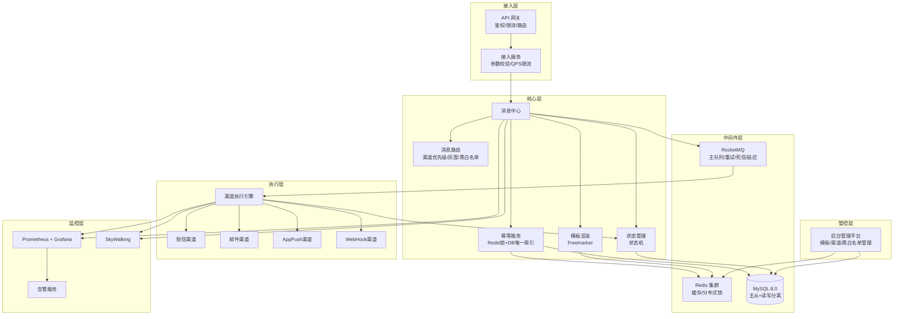
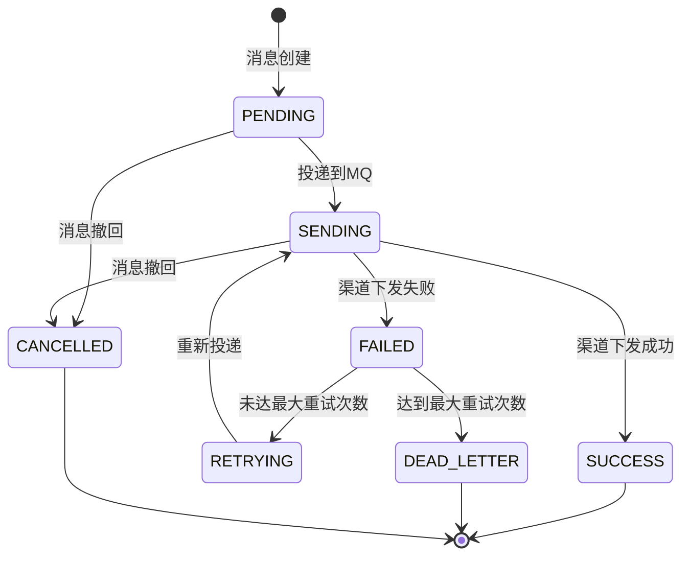
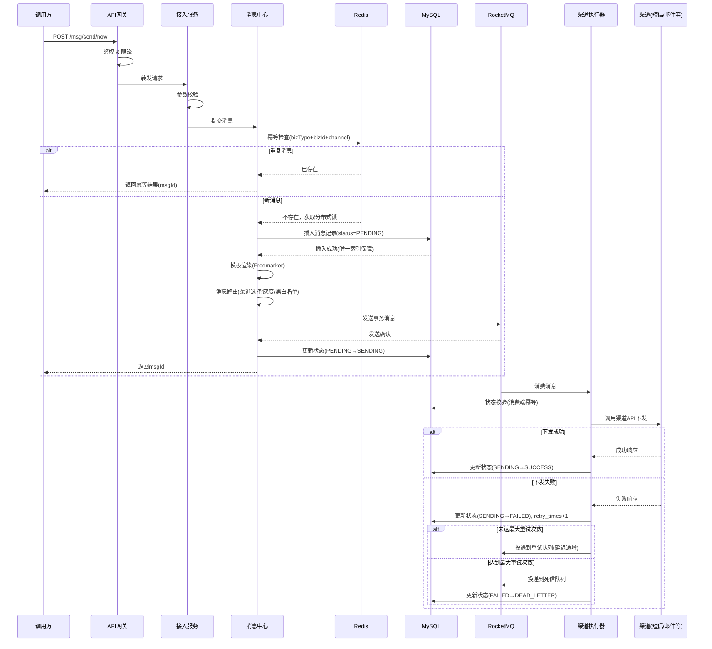
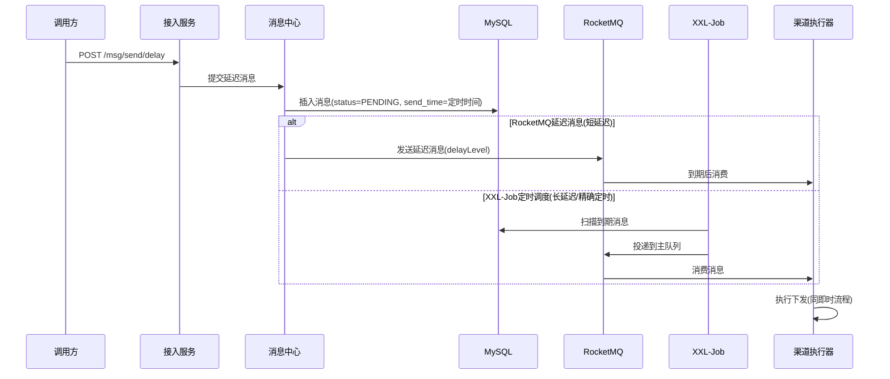
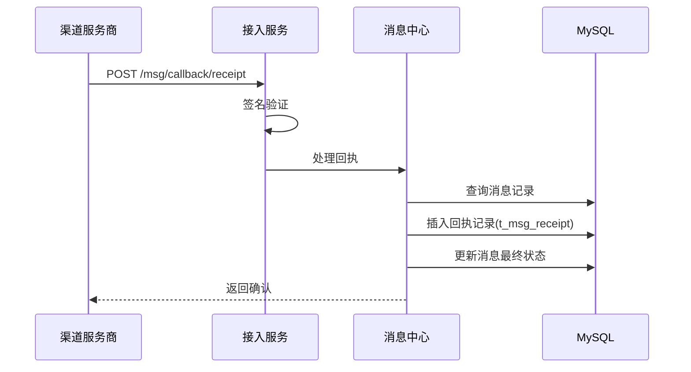

# 设计文档：消息下发系统（Message Delivery System）

## 概述

消息下发系统是一个面向生产环境的高可靠、高并发消息分发平台，统一承接系统内通知、告警、运营推送、第三方回调等多种消息下发场景。系统基于 SpringBoot 2.7.x + SpringCloud 微服务架构，以 RocketMQ 作为消息中间件核心，实现消息的可靠投递、多渠道统一抽象、全链路状态追踪与灰度管控。

系统采用分层架构设计，从接入层到执行层实现关注点分离：接入层负责鉴权限流与参数校验，核心层处理幂等、路由、模板渲染与状态管理，执行层通过统一的渠道抽象完成多渠道下发。通过 Redis 分布式锁 + DB 唯一索引的双重幂等保障、RocketMQ 事务消息的可靠投递、以及完善的重试与死信机制，确保消息零丢失。

非功能性方面，系统目标支撑万级 QPS 并发下发，接口响应 P99 < 200ms，消费处理 < 500ms，可用性达到 99.99%。通过 Prometheus + Grafana 实现实时监控，SkyWalking 实现全链路追踪，Sentinel 实现限流熔断，XXL-Job 处理定时任务调度。

## 架构

### 整体架构



### 消息状态机



## 时序图

### 即时消息下发流程



### 延迟/定时消息下发流程



### 渠道回执回调流程



## 组件与接口

### 组件1：接入服务（AccessService）

**职责**：统一接收外部下发请求，完成鉴权、参数校验、QPS限流

**接口**：
```java
public interface AccessService {

    /**
     * 即时消息下发
     * @param request 下发请求
     * @return 下发结果(包含msgId)
     */
    SendResult sendNow(SendRequest request);

    /**
     * 延迟/定时消息下发
     * @param request 延迟下发请求(含sendTime)
     * @return 下发结果
     */
    SendResult sendDelay(DelaySendRequest request);

    /**
     * 消息状态查询
     * @param query 查询条件(msgId或bizType+bizId)
     * @return 消息状态信息
     */
    MessageStatusVO queryStatus(StatusQuery query);

    /**
     * 消息撤回
     * @param request 撤回请求
     * @return 撤回结果
     */
    CancelResult cancel(CancelRequest request);

    /**
     * 渠道回执回调
     * @param receipt 回执数据
     * @return 处理结果
     */
    ReceiptResult handleReceipt(ReceiptCallback receipt);
}
```

**职责清单**：
- 请求参数校验（JSR303 + 自定义校验）
- 调用方鉴权（AppKey + Secret 签名验证）
- QPS 限流（Sentinel 令牌桶）
- 请求日志记录与链路追踪埋点

### 组件2：消息中心（MessageCenter）

**职责**：消息处理核心，负责幂等校验、路由决策、模板渲染、状态管理

**接口**：
```java
public interface MessageCenter {

    /**
     * 处理消息下发
     * @param message 内部消息对象
     * @return 处理结果
     */
    ProcessResult process(InternalMessage message);

    /**
     * 幂等检查
     * @param bizType 业务类型
     * @param bizId 业务ID
     * @param channel 渠道
     * @return 是否重复(重复则返回已有msgId)
     */
    IdempotentResult checkIdempotent(String bizType, String bizId, String channel);

    /**
     * 消息路由决策
     * @param message 消息对象
     * @return 路由结果(目标渠道列表)
     */
    RouteResult route(InternalMessage message);

    /**
     * 模板渲染
     * @param templateCode 模板编码
     * @param variables 变量Map
     * @return 渲染后的内容
     */
    String renderTemplate(String templateCode, Map<String, Object> variables);

    /**
     * 状态流转
     * @param msgId 消息ID
     * @param fromStatus 当前状态
     * @param toStatus 目标状态
     * @return 是否流转成功
     */
    boolean transitStatus(String msgId, MessageStatus fromStatus, MessageStatus toStatus);
}
```

**职责清单**：
- 三级幂等保障（Redis分布式锁 → DB唯一索引 → 消费端状态校验）
- 渠道路由（优先级路由、灰度路由、黑白名单过滤）
- Freemarker 模板渲染
- 消息状态机管理

### 组件3：渠道执行器（ChannelExecutor）

**职责**：统一抽象多渠道下发，消费MQ消息并调用具体渠道API

**接口**：
```java
/**
 * 渠道发送器统一抽象接口
 */
public interface ChannelSender {

    /**
     * 获取渠道类型
     */
    ChannelType getChannelType();

    /**
     * 执行消息下发
     * @param context 下发上下文(含渲染后内容、接收人、渠道配置等)
     * @return 下发结果
     */
    SendChannelResult send(SendContext context);

    /**
     * 检查渠道健康状态
     * @return 是否可用
     */
    boolean healthCheck();
}

/**
 * 渠道执行引擎
 */
public interface ChannelExecutor {

    /**
     * 执行消息下发(自动选择渠道发送器)
     * @param message MQ消费到的消息
     */
    void execute(MQMessage message);

    /**
     * 注册渠道发送器
     * @param sender 渠道发送器实现
     */
    void registerSender(ChannelSender sender);
}
```

**职责清单**：
- MQ 消息消费与消费端幂等校验
- 渠道发送器自动路由（策略模式）
- 下发结果处理与状态更新
- 失败重试投递与死信处理

### 组件4：重试与死信处理器（RetryHandler）

**职责**：管理消息重试策略与死信队列处理

**接口**：
```java
public interface RetryHandler {

    /**
     * 计算下次重试延迟
     * @param retryTimes 当前重试次数
     * @return 延迟时间(秒)，-1表示不再重试
     */
    long calculateDelay(int retryTimes);

    /**
     * 投递到重试队列
     * @param msgId 消息ID
     * @param retryTimes 当前重试次数
     * @return 是否投递成功
     */
    boolean submitRetry(String msgId, int retryTimes);

    /**
     * 投递到死信队列
     * @param msgId 消息ID
     * @param reason 死信原因
     */
    void submitDeadLetter(String msgId, String reason);
}
```

## 数据模型

### 消息主表（t_msg）

```java
/**
 * 消息主表实体
 */
@Data
@TableName("t_msg")
public class MessageEntity {
    /** 主键 */
    private Long id;
    /** 消息ID(全局唯一，雪花算法) */
    private String msgId;
    /** 业务类型 */
    private String bizType;
    /** 业务ID */
    private String bizId;
    /** 渠道类型: SMS/EMAIL/APP_PUSH/WEBHOOK */
    private String channel;
    /** 消息模板编码 */
    private String templateCode;
    /** 渲染后的消息内容 */
    private String content;
    /** 接收人(手机号/邮箱/设备ID/URL) */
    private String receiver;
    /** 消息状态: PENDING/SENDING/SUCCESS/FAILED/RETRYING/DEAD_LETTER/CANCELLED */
    private String status;
    /** 已重试次数 */
    private Integer retryTimes;
    /** 最大重试次数 */
    private Integer maxRetryTimes;
    /** 计划发送时间(延迟消息) */
    private LocalDateTime sendTime;
    /** 实际发送时间 */
    private LocalDateTime actualSendTime;
    /** 优先级: 1-高 2-中 3-低 */
    private Integer priority;
    /** 扩展参数(JSON) */
    private String extParams;
    /** 创建时间 */
    private LocalDateTime createTime;
    /** 更新时间 */
    private LocalDateTime updateTime;
}
```

**唯一索引**：`uk_biz_channel (biz_type, biz_id, channel)` — 幂等保障

**普通索引**：
- `idx_msg_id (msg_id)`
- `idx_status_send_time (status, send_time)` — 定时任务扫描
- `idx_create_time (create_time)` — 数据归档

### 消息回执表（t_msg_receipt）

```java
@Data
@TableName("t_msg_receipt")
public class MessageReceiptEntity {
    private Long id;
    /** 关联消息ID */
    private String msgId;
    /** 渠道类型 */
    private String channel;
    /** 渠道方消息ID */
    private String channelMsgId;
    /** 回执状态: DELIVERED/READ/REJECTED/UNKNOWN */
    private String receiptStatus;
    /** 回执时间 */
    private LocalDateTime receiptTime;
    /** 回执原始数据(JSON) */
    private String rawData;
    private LocalDateTime createTime;
}
```

### 渠道配置表（t_channel_config）

```java
@Data
@TableName("t_channel_config")
public class ChannelConfigEntity {
    private Long id;
    /** 渠道编码 */
    private String channelCode;
    /** 渠道类型: SMS/EMAIL/APP_PUSH/WEBHOOK */
    private String channelType;
    /** 渠道名称 */
    private String channelName;
    /** 渠道配置(JSON: appKey/secret/endpoint等) */
    private String config;
    /** 权重(负载均衡) */
    private Integer weight;
    /** QPS限制 */
    private Integer qpsLimit;
    /** 是否启用 */
    private Boolean enabled;
    /** 优先级 */
    private Integer priority;
    private LocalDateTime createTime;
    private LocalDateTime updateTime;
}
```

### 消息模板表（t_msg_template）

```java
@Data
@TableName("t_msg_template")
public class MessageTemplateEntity {
    private Long id;
    /** 模板编码(唯一) */
    private String templateCode;
    /** 模板名称 */
    private String templateName;
    /** 渠道类型 */
    private String channelType;
    /** 模板内容(Freemarker语法) */
    private String content;
    /** 模板变量说明(JSON) */
    private String variables;
    /** 是否启用 */
    private Boolean enabled;
    private LocalDateTime createTime;
    private LocalDateTime updateTime;
}
```

**校验规则**：
- `msgId`：全局唯一，雪花算法生成
- `bizType + bizId + channel`：唯一索引，幂等保障
- `status`：枚举值，状态流转需遵循状态机约束
- `retryTimes`：不超过 `maxRetryTimes`（默认10）
- `templateCode`：必须对应已启用的模板
- `channel`：必须对应已启用的渠道配置


## 算法伪代码

### 消息下发主流程算法

```java
/**
 * 算法：消息下发主流程
 * 输入：SendRequest request — 下发请求
 * 输出：SendResult — 下发结果(含msgId)
 *
 * 前置条件：
 *   - request 非空且通过参数校验
 *   - request.bizType、bizId、channel 均非空
 *   - 调用方已通过鉴权
 *
 * 后置条件：
 *   - 若为新消息：DB中存在对应记录，状态为SENDING，MQ中存在待消费消息
 *   - 若为重复消息：返回已有msgId，无副作用
 *   - 返回的SendResult.msgId 非空
 */
public SendResult processSendNow(SendRequest request) {
    // Step 1: 幂等检查 — Redis分布式锁
    String idempotentKey = request.getBizType() + ":" + request.getBizId() + ":" + request.getChannel();
    boolean locked = redis.tryLock(idempotentKey, LOCK_TIMEOUT);

    if (!locked) {
        // 并发请求，查询已有记录返回
        MessageEntity existing = messageMapper.selectByBizKey(
            request.getBizType(), request.getBizId(), request.getChannel());
        if (existing != null) {
            return SendResult.idempotent(existing.getMsgId());
        }
        throw new ConcurrentSendException("并发下发冲突，请重试");
    }

    try {
        // Step 2: 幂等检查 — DB唯一索引二次校验
        MessageEntity existing = messageMapper.selectByBizKey(
            request.getBizType(), request.getBizId(), request.getChannel());
        if (existing != null) {
            return SendResult.idempotent(existing.getMsgId());
        }

        // Step 3: 生成消息ID(雪花算法)
        String msgId = snowflakeIdGenerator.nextId();

        // Step 4: 模板渲染
        String content = templateEngine.render(request.getTemplateCode(), request.getVariables());

        // Step 5: 消息路由决策
        RouteResult routeResult = messageRouter.route(request);
        if (routeResult.isBlocked()) {
            return SendResult.blocked(routeResult.getReason());
        }

        // Step 6: 持久化消息记录
        MessageEntity entity = buildMessageEntity(msgId, request, content, routeResult);
        entity.setStatus(MessageStatus.PENDING.name());
        messageMapper.insert(entity); // 唯一索引保障最终幂等

        // Step 7: 发送RocketMQ事务消息
        TransactionSendResult mqResult = rocketMQTemplate.sendMessageInTransaction(
            TOPIC_MSG_SEND, buildMQMessage(entity), entity);

        // Step 8: 更新状态为SENDING
        messageMapper.updateStatus(msgId, MessageStatus.PENDING, MessageStatus.SENDING);

        return SendResult.success(msgId);
    } finally {
        redis.unlock(idempotentKey);
    }
}
```

### 渠道执行算法

```java
/**
 * 算法：渠道执行与重试
 * 输入：MQMessage mqMessage — MQ消费到的消息
 * 输出：无(副作用：更新DB状态，可能投递重试/死信队列)
 *
 * 前置条件：
 *   - mqMessage 包含有效的 msgId
 *   - DB中存在对应消息记录
 *   - 消息状态为 SENDING 或 RETRYING
 *
 * 后置条件：
 *   - 成功：消息状态变为 SUCCESS
 *   - 失败且可重试：消息投递到重试队列，retryTimes+1
 *   - 失败且不可重试：消息状态变为 DEAD_LETTER，投递到死信队列
 *
 * 循环不变量：
 *   - 每次重试 retryTimes 严格递增
 *   - retryTimes <= maxRetryTimes
 */
public void executeChannel(MQMessage mqMessage) {
    String msgId = mqMessage.getMsgId();

    // Step 1: 消费端幂等校验
    MessageEntity msg = messageMapper.selectByMsgId(msgId);
    if (msg == null) {
        log.warn("消息不存在，丢弃: {}", msgId);
        return;
    }
    if (MessageStatus.SUCCESS.name().equals(msg.getStatus())
        || MessageStatus.CANCELLED.name().equals(msg.getStatus())
        || MessageStatus.DEAD_LETTER.name().equals(msg.getStatus())) {
        log.info("消息已终态，跳过: {} status={}", msgId, msg.getStatus());
        return;
    }

    // Step 2: 获取渠道发送器
    ChannelSender sender = channelSenderRegistry.getSender(
        ChannelType.valueOf(msg.getChannel()));
    if (sender == null) {
        log.error("未找到渠道发送器: {}", msg.getChannel());
        retryHandler.submitDeadLetter(msgId, "渠道发送器不存在: " + msg.getChannel());
        return;
    }

    // Step 3: 构建下发上下文
    SendContext context = buildSendContext(msg);

    // Step 4: 执行下发
    try {
        SendChannelResult result = sender.send(context);

        if (result.isSuccess()) {
            // 下发成功
            messageMapper.updateStatus(msgId, MessageStatus.SENDING, MessageStatus.SUCCESS);
            messageMapper.updateActualSendTime(msgId, LocalDateTime.now());
        } else {
            // 下发失败，进入重试判断
            handleSendFailure(msg, result.getErrorMessage());
        }
    } catch (Exception e) {
        log.error("渠道下发异常: msgId={}", msgId, e);
        handleSendFailure(msg, e.getMessage());
    }
}

/**
 * 处理下发失败
 *
 * 前置条件：msg.retryTimes >= 0
 * 后置条件：
 *   - retryTimes < maxRetryTimes → 投递重试队列，retryTimes+1
 *   - retryTimes >= maxRetryTimes → 投递死信队列，状态变为DEAD_LETTER
 */
private void handleSendFailure(MessageEntity msg, String errorMessage) {
    int currentRetry = msg.getRetryTimes();
    int maxRetry = msg.getMaxRetryTimes();

    messageMapper.updateStatus(msg.getMsgId(), MessageStatus.SENDING, MessageStatus.FAILED);

    if (currentRetry < maxRetry) {
        // 可重试
        messageMapper.incrementRetryTimes(msg.getMsgId());
        messageMapper.updateStatus(msg.getMsgId(), MessageStatus.FAILED, MessageStatus.RETRYING);
        retryHandler.submitRetry(msg.getMsgId(), currentRetry + 1);
    } else {
        // 达到最大重试次数，进入死信
        retryHandler.submitDeadLetter(msg.getMsgId(), errorMessage);
        messageMapper.updateStatus(msg.getMsgId(), MessageStatus.FAILED, MessageStatus.DEAD_LETTER);
    }
}
```

### 重试延迟计算算法

```java
/**
 * 算法：重试延迟计算（递增退避策略）
 * 输入：retryTimes — 当前重试次数(从1开始)
 * 输出：延迟秒数，-1表示不再重试
 *
 * 重试策略：10s → 30s → 1min → 5min → 30min → 1h → 2h → 6h → 12h
 * 最大重试次数：10次
 *
 * 前置条件：retryTimes >= 1
 * 后置条件：
 *   - 1 <= retryTimes <= 9 → 返回对应延迟秒数(>0)
 *   - retryTimes > 9 → 返回 -1
 *
 * 循环不变量：N/A（无循环，查表法）
 */
public long calculateDelay(int retryTimes) {
    // 重试延迟表(秒)
    long[] RETRY_DELAYS = {
        10,      // 第1次: 10秒
        30,      // 第2次: 30秒
        60,      // 第3次: 1分钟
        300,     // 第4次: 5分钟
        1800,    // 第5次: 30分钟
        3600,    // 第6次: 1小时
        7200,    // 第7次: 2小时
        21600,   // 第8次: 6小时
        43200    // 第9次: 12小时
    };

    if (retryTimes < 1 || retryTimes > RETRY_DELAYS.length) {
        return -1; // 不再重试
    }
    return RETRY_DELAYS[retryTimes - 1];
}
```

### 消息路由算法

```java
/**
 * 算法：消息路由决策
 * 输入：InternalMessage message — 内部消息对象
 * 输出：RouteResult — 路由结果(目标渠道、是否拦截)
 *
 * 前置条件：
 *   - message.receiver 非空
 *   - message.channel 对应的渠道配置存在
 *
 * 后置条件：
 *   - 黑名单命中 → blocked=true, reason="黑名单拦截"
 *   - 灰度未命中 → blocked=true, reason="灰度未覆盖"
 *   - 正常 → blocked=false, 返回可用渠道配置(按优先级排序)
 */
public RouteResult route(InternalMessage message) {
    // Step 1: 黑名单检查
    boolean inBlacklist = blacklistService.check(message.getReceiver(), message.getChannel());
    if (inBlacklist) {
        return RouteResult.blocked("黑名单拦截: " + message.getReceiver());
    }

    // Step 2: 白名单检查(如果启用白名单模式，仅白名单内可下发)
    if (whitelistService.isEnabled(message.getChannel())) {
        boolean inWhitelist = whitelistService.check(message.getReceiver(), message.getChannel());
        if (!inWhitelist) {
            return RouteResult.blocked("白名单模式，接收人不在白名单内");
        }
    }

    // Step 3: 灰度路由检查
    if (grayRuleService.isGrayEnabled(message.getChannel())) {
        boolean hitGray = grayRuleService.evaluate(message);
        if (!hitGray) {
            return RouteResult.blocked("灰度规则未命中");
        }
    }

    // Step 4: 获取可用渠道配置(按优先级排序)
    List<ChannelConfigEntity> configs = channelConfigMapper
        .selectEnabledByType(message.getChannel());
    if (configs.isEmpty()) {
        return RouteResult.blocked("无可用渠道配置: " + message.getChannel());
    }

    // Step 5: 按优先级和权重选择渠道
    ChannelConfigEntity selected = selectByPriorityAndWeight(configs);

    return RouteResult.success(selected);
}
```

## 关键函数形式化规格说明

### checkIdempotent()

```java
IdempotentResult checkIdempotent(String bizType, String bizId, String channel)
```

**前置条件**：
- `bizType` 非空，长度 ≤ 64
- `bizId` 非空，长度 ≤ 128
- `channel` 非空，为合法枚举值（SMS/EMAIL/APP_PUSH/WEBHOOK）

**后置条件**：
- 若 Redis 中存在 key `idem:{bizType}:{bizId}:{channel}` → 返回 `IdempotentResult.duplicate(existingMsgId)`
- 若 DB 中存在唯一索引匹配记录 → 返回 `IdempotentResult.duplicate(existingMsgId)`
- 否则 → 返回 `IdempotentResult.pass()`
- 无论结果如何，不产生写入副作用

**循环不变量**：N/A

### transitStatus()

```java
boolean transitStatus(String msgId, MessageStatus fromStatus, MessageStatus toStatus)
```

**前置条件**：
- `msgId` 非空，对应记录存在于 DB
- `fromStatus` 和 `toStatus` 为合法枚举值
- 状态转换符合状态机约束：
  - PENDING → SENDING | CANCELLED
  - SENDING → SUCCESS | FAILED | CANCELLED
  - FAILED → RETRYING | DEAD_LETTER
  - RETRYING → SENDING

**后置条件**：
- 合法转换 → DB 中该记录 status 更新为 `toStatus`，返回 `true`
- 非法转换 → DB 无变更，返回 `false`
- 使用乐观锁（WHERE status = fromStatus）保证并发安全

**循环不变量**：N/A

### renderTemplate()

```java
String renderTemplate(String templateCode, Map<String, Object> variables)
```

**前置条件**：
- `templateCode` 非空，对应模板存在且已启用
- `variables` 非空，包含模板所需的所有变量

**后置条件**：
- 返回渲染后的字符串，所有占位符 `${xxx}` 均已替换
- 渲染结果非空
- 模板缓存命中时从 Redis 读取，未命中时从 DB 加载并写入缓存
- 不修改输入参数

**循环不变量**：N/A

### calculateDelay()

```java
long calculateDelay(int retryTimes)
```

**前置条件**：
- `retryTimes` 为整数

**后置条件**：
- `1 ≤ retryTimes ≤ 9` → 返回值 > 0，且 `delay[n] ≤ delay[n+1]`（单调递增）
- `retryTimes < 1 || retryTimes > 9` → 返回 -1
- 无副作用

**循环不变量**：N/A

## 示例用法

### 即时消息下发

```java
// 构建下发请求
SendRequest request = SendRequest.builder()
    .bizType("ORDER_NOTIFY")
    .bizId("ORDER_20240101_001")
    .channel("SMS")
    .templateCode("order_shipped")
    .receiver("138xxxx1234")
    .variables(Map.of(
        "orderNo", "ORDER_20240101_001",
        "expressNo", "SF1234567890"
    ))
    .priority(2)
    .build();

// 调用下发接口
SendResult result = accessService.sendNow(request);
// result.getMsgId() => "1745678901234567680"
// result.getStatus() => "ACCEPTED"
```

### 延迟消息下发

```java
// 构建延迟下发请求（30分钟后发送）
DelaySendRequest delayRequest = DelaySendRequest.builder()
    .bizType("PROMOTION")
    .bizId("PROMO_2024_SPRING_001")
    .channel("APP_PUSH")
    .templateCode("promotion_push")
    .receiver("user_device_token_xxx")
    .variables(Map.of("title", "春季大促", "discount", "8折"))
    .sendTime(LocalDateTime.now().plusMinutes(30))
    .build();

SendResult result = accessService.sendDelay(delayRequest);
```

### 消息状态查询

```java
// 按msgId查询
StatusQuery query = StatusQuery.builder()
    .msgId("1745678901234567680")
    .build();
MessageStatusVO status = accessService.queryStatus(query);
// status.getStatus() => "SUCCESS"
// status.getRetryTimes() => 0
// status.getActualSendTime() => "2024-01-01T10:30:15"

// 按业务键查询
StatusQuery bizQuery = StatusQuery.builder()
    .bizType("ORDER_NOTIFY")
    .bizId("ORDER_20240101_001")
    .build();
MessageStatusVO bizStatus = accessService.queryStatus(bizQuery);
```

### 消息撤回

```java
CancelRequest cancelRequest = CancelRequest.builder()
    .msgId("1745678901234567680")
    .reason("用户取消订单")
    .build();

CancelResult cancelResult = accessService.cancel(cancelRequest);
// cancelResult.isSuccess() => true (仅PENDING/SENDING状态可撤回)
```

### 自定义渠道发送器

```java
// 实现自定义WebHook渠道发送器
@Component
public class WebHookChannelSender implements ChannelSender {

    @Override
    public ChannelType getChannelType() {
        return ChannelType.WEBHOOK;
    }

    @Override
    public SendChannelResult send(SendContext context) {
        String url = context.getChannelConfig().getEndpoint();
        String payload = context.getRenderedContent();

        HttpResponse response = httpClient.post(url)
            .header("X-Signature", signPayload(payload, context.getChannelConfig().getSecret()))
            .body(payload)
            .timeout(Duration.ofSeconds(5))
            .execute();

        if (response.isSuccess()) {
            return SendChannelResult.success(response.getHeader("X-Message-Id"));
        } else {
            return SendChannelResult.fail("WebHook调用失败: HTTP " + response.getStatus());
        }
    }

    @Override
    public boolean healthCheck() {
        // 检查WebHook端点可达性
        return true;
    }
}
```


## 正确性属性

*属性是系统在所有合法执行中应保持为真的特征或行为——本质上是关于系统应该做什么的形式化声明。属性是人类可读规格说明与机器可验证正确性保证之间的桥梁。*

### Property 1: 幂等性保证

*For any* 两个下发请求 request₁ 和 request₂，若它们的 bizType、bizId、channel 完全相同，则多次调用 processSendNow 应返回相同的 msgId，且数据库中仅存在一条对应记录。

**Validates: Requirements 3.1, 3.2**

### Property 2: 状态机合法性

*For any* 消息状态转换 (fromStatus, toStatus)，transitStatus 返回 true 当且仅当该转换属于合法转换集合 {(PENDING, SENDING), (PENDING, CANCELLED), (SENDING, SUCCESS), (SENDING, FAILED), (SENDING, CANCELLED), (FAILED, RETRYING), (FAILED, DEAD_LETTER), (RETRYING, SENDING)}；对于所有不在此集合中的转换，transitStatus 应返回 false 且数据库无变更。

**Validates: Requirements 4.1, 4.3, 5.1, 5.2, 5.3**

### Property 3: 重试次数有界性

*For any* 消息实体，retryTimes 始终不超过 maxRetryTimes；且当 retryTimes 等于 maxRetryTimes 时，消息状态应属于终态集合 {SUCCESS, DEAD_LETTER}。

**Validates: Requirements 8.1, 8.5**

### Property 4: 重试延迟单调递增

*For any* 两个重试次数 i 和 j（1 ≤ i < j ≤ 9），calculateDelay(i) 严格小于 calculateDelay(j)。

**Validates: Requirements 8.2, 8.3**

### Property 5: 消息最终一致性

*For any* 消息实体，经过有限时间后，消息状态应到达终态集合 {SUCCESS, DEAD_LETTER, CANCELLED}，即不存在永久停留在 PENDING/SENDING/FAILED/RETRYING 状态的消息。

**Validates: Requirements 1.6, 4.1, 8.4**

### Property 6: 路由拦截完整性

*For any* 消息，若接收人在黑名单中，则路由结果应为 blocked；若白名单模式启用且接收人不在白名单中，则路由结果应为 blocked；若灰度规则启用且消息未命中灰度规则，则路由结果应为 blocked。被拦截的消息不投递到 MQ。

**Validates: Requirements 6.2, 6.3, 6.4**

### Property 7: 模板渲染完整性

*For any* 合法的模板编码和完整的变量集，renderTemplate 返回的渲染结果中不包含未替换的占位符 `${...}`。

**Validates: Requirements 7.1, 7.2**

### Property 8: 消费端幂等性

*For any* 已处于终态（SUCCESS/CANCELLED/DEAD_LETTER）的消息，渠道执行器消费该消息时应跳过处理，不调用渠道 API，即重复消费不会导致重复下发。

**Validates: Requirements 3.5**

### Property 9: msgId 全局唯一性

*For any* 两条不同的消息（bizType+bizId+channel 不同），消息中心生成的 msgId 应互不相同。

**Validates: Requirements 1.2**

### Property 10: 渠道路由正确性

*For any* 消息和已注册的渠道发送器集合，渠道执行器应根据消息的 channel 字段路由到 getChannelType() 返回值匹配的渠道发送器实现。

**Validates: Requirements 9.2**

### Property 11: 渠道选择优先级

*For any* 通过所有路由检查的消息，消息路由器返回的渠道配置应是该渠道类型下已启用且优先级最高的配置。

**Validates: Requirements 6.5**

### Property 12: 密钥加密 Round-Trip

*For any* 渠道配置中的 Secret 或 Token 值，加密后解密应得到与原始值完全相同的结果。

**Validates: Requirements 13.1**

### Property 13: 日志脱敏完整性

*For any* 包含手机号或邮箱的日志输出，脱敏处理后的日志内容不应包含完整的手机号或邮箱地址。

**Validates: Requirements 13.2**

### Property 14: 签名验证正确性

*For any* 合法的 AppKey + Secret 组合和请求内容，使用正确密钥生成的 HMAC-SHA256 签名应通过验证；使用错误密钥生成的签名应验证失败。

**Validates: Requirements 11.1**

## 错误处理

### 场景1：渠道API超时

**触发条件**：调用渠道API（短信/邮件等）超过5秒未响应
**处理方式**：捕获 `TimeoutException`，标记为下发失败，进入重试流程
**恢复策略**：按递增退避策略重试，最终进入死信队列；同时触发渠道健康检查，连续超时则熔断该渠道

### 场景2：RocketMQ 投递失败

**触发条件**：事务消息发送到 RocketMQ 失败
**处理方式**：消息状态保持 PENDING，返回客户端失败结果
**恢复策略**：客户端可重试（幂等保障安全重试）；XXL-Job 定时扫描 PENDING 超时消息进行补偿投递

### 场景3：Redis 不可用

**触发条件**：Redis 集群故障，分布式锁获取失败
**处理方式**：降级到 DB 唯一索引保障幂等，跳过 Redis 缓存直接查询 DB
**恢复策略**：Sentinel 熔断 Redis 调用，Redis 恢复后自动恢复；缓存预热重建

### 场景4：模板渲染失败

**触发条件**：模板不存在、变量缺失、Freemarker 语法错误
**处理方式**：抛出 `TemplateRenderException`，消息状态直接置为 FAILED（不重试）
**恢复策略**：记录详细错误日志，通知管理员修复模板；修复后可手动重新触发

### 场景5：数据库写入失败（唯一索引冲突）

**触发条件**：并发插入相同 `bizType+bizId+channel` 的消息
**处理方式**：捕获 `DuplicateKeyException`，查询已有记录返回幂等结果
**恢复策略**：这是幂等设计的正常路径，无需额外恢复

### 场景6：消息状态流转冲突

**触发条件**：并发更新同一消息状态（乐观锁失败）
**处理方式**：`transitStatus` 返回 `false`，调用方根据业务逻辑决定是否重试
**恢复策略**：重新查询当前状态后重试状态流转；若已到达终态则跳过

## 测试策略

### 单元测试

**覆盖目标**：核心业务逻辑 ≥ 90% 行覆盖率

**关键测试用例**：
- 幂等检查：相同 bizKey 多次调用返回相同 msgId
- 状态机流转：所有合法/非法转换路径
- 重试延迟计算：边界值（retryTimes=0, 1, 9, 10, 11）
- 模板渲染：正常渲染、变量缺失、模板不存在
- 消息路由：黑名单命中、白名单模式、灰度规则

### 属性测试

**属性测试库**：jqwik（Java Property-Based Testing）

**属性测试用例**：
- P1 幂等性：随机生成 bizType+bizId+channel 组合，多次调用结果一致
- P3 重试有界性：随机 retryTimes，验证 retryTimes ≤ maxRetryTimes
- P4 延迟单调性：随机生成 (i, j) 对，i < j 时 delay(i) < delay(j)
- P2 状态机合法性：随机生成状态转换对，验证合法/非法判定正确

### 集成测试

**测试范围**：
- 接入服务 → 消息中心 → RocketMQ → 渠道执行器 全链路
- Redis 降级场景（模拟 Redis 不可用）
- RocketMQ 事务消息回查
- 重试队列 → 死信队列 完整流转
- 多渠道并发下发

**测试环境**：
- 嵌入式 Redis（Embedded Redis）
- RocketMQ 测试容器（Testcontainers）
- H2 内存数据库（单元测试）/ MySQL 测试实例（集成测试）

## 性能考量

- **QPS 目标**：万级并发下发，接入层通过 Sentinel 令牌桶限流保护后端
- **接口响应**：P99 < 200ms，核心路径避免同步阻塞调用
- **消费吞吐**：RocketMQ 消费者线程池可配置（默认20线程），支持水平扩展
- **数据库优化**：读写分离（写主库、读从库），热点查询走 Redis 缓存
- **消息表分区**：按 `create_time` 月度分区，历史数据定期归档
- **批量操作**：批量消息下发支持 MQ 批量发送，减少网络开销
- **连接池**：数据库连接池（HikariCP）、Redis 连接池（Lettuce）、HTTP 连接池（OkHttp）合理配置

## 安全考量

- **接口鉴权**：AppKey + Secret HMAC-SHA256 签名验证，防止未授权调用
- **传输安全**：全链路 HTTPS/TLS，RocketMQ 开启 ACL
- **数据脱敏**：日志中手机号、邮箱等敏感信息脱敏输出
- **SQL 注入防护**：MyBatis 参数化查询，禁止拼接 SQL
- **限流防刷**：Sentinel 多维度限流（AppKey级、接口级、IP级）
- **渠道密钥管理**：渠道配置中的 Secret/Token 加密存储（AES-256），运行时解密
- **回执验签**：渠道回执回调需验证签名，防止伪造回执

## 依赖

| 依赖 | 版本 | 用途 |
|------|------|------|
| SpringBoot | 2.7.x | 应用框架 |
| SpringCloud | 2021.x | 微服务治理 |
| RocketMQ | 4.9.x | 消息队列 |
| MySQL | 8.0 | 持久化存储 |
| Redis | 6.x+ | 缓存 & 分布式锁 |
| MyBatis-Plus | 3.5.x | ORM框架 |
| Freemarker | 2.3.x | 模板引擎 |
| Sentinel | 1.8.x | 限流熔断 |
| SkyWalking | 9.x | 链路追踪 |
| Prometheus | - | 指标监控 |
| Grafana | - | 监控面板 |
| XXL-Job | 2.4.x | 定时任务调度 |
| Snowflake | - | 分布式ID生成 |
| jqwik | 1.8.x | 属性测试 |
| Testcontainers | 1.19.x | 集成测试容器 |
