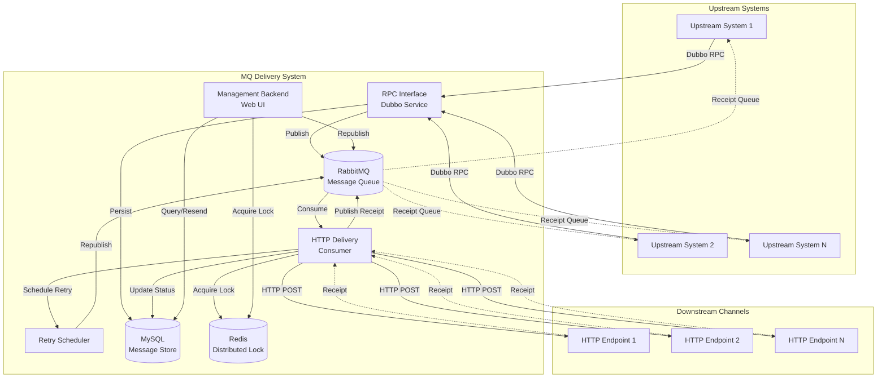
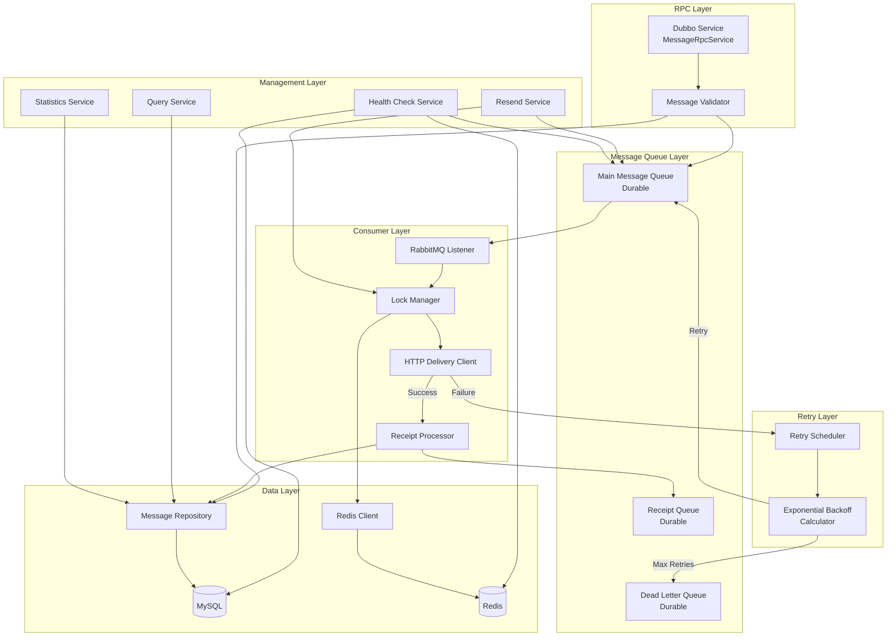
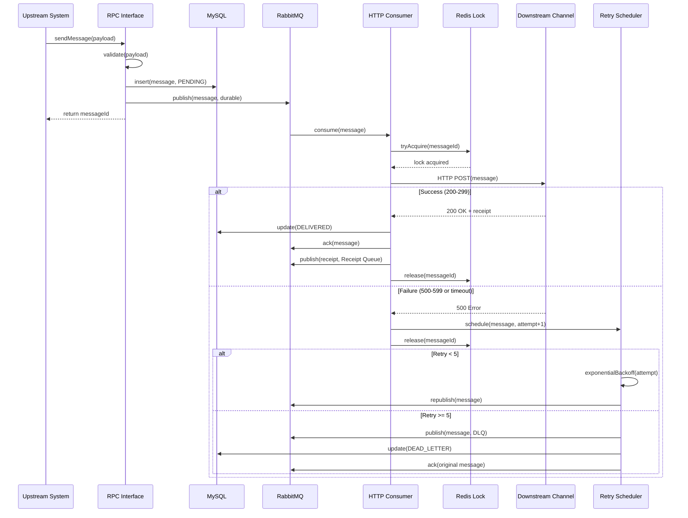
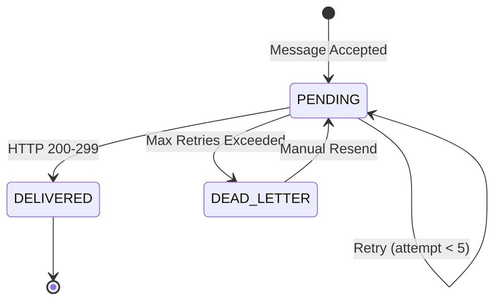

# Design Document: MQ Delivery System

## Overview

The MQ Delivery System is a high-availability message queue wrapper built on RabbitMQ that provides reliable message delivery with receipt tracking. The system bridges upstream systems (via Dubbo RPC) with downstream HTTP endpoints, ensuring message persistence, automatic retry with exponential backoff, and comprehensive monitoring capabilities.

### Core Responsibilities

- Accept messages from upstream systems via Dubbo RPC interface
- Persist messages to RabbitMQ with durable queues and persistent delivery mode
- Deliver messages to downstream channels via HTTP POST requests
- Process and forward receipts back to upstream systems
- Implement automatic retry with exponential backoff for failed deliveries
- Manage dead letter queue for permanently failed messages
- Provide management backend for message query, resend, and monitoring
- Ensure message idempotency and distributed coordination via Redis locks

### Design Decisions

1. **RabbitMQ as Message Backbone**: RabbitMQ provides proven reliability with durable queues, persistent messages, and manual acknowledgment mode. This ensures messages survive broker restarts and are not lost during failures.

2. **Manual Acknowledgment Mode**: Consumers use manual acknowledgment to ensure messages are only removed from queues after successful processing. This prevents message loss during consumer failures.

3. **Exponential Backoff Retry**: Failed deliveries are retried with exponentially increasing delays (1s, 2s, 4s, 8s, up to 300s max) to handle transient downstream failures without overwhelming the system.

4. **Redis Distributed Locks**: Redis-based distributed locks prevent concurrent processing of the same message across multiple consumer instances, ensuring exactly-once processing semantics.

5. **Separate Receipt Queue**: Receipts are published to a dedicated durable queue, allowing upstream systems to consume delivery confirmations asynchronously and independently from the main message flow.

6. **MySQL for Message Store**: All messages are persisted to MySQL with status tracking (PENDING, DELIVERED, FAILED, DEAD_LETTER), providing queryability and audit trail.

7. **Dead Letter Queue Pattern**: Messages that fail after maximum retry attempts are moved to a dead letter queue for manual investigation and reprocessing, preventing infinite retry loops.

8. **Graceful Shutdown**: The system waits up to 60 seconds for in-flight messages to complete during shutdown, negatively acknowledging incomplete messages to ensure they are redelivered after restart.

## Architecture

### System Context Diagram



### Component Architecture



### Message Flow Sequence



## Components and Interfaces

### Component 1: MessageRpcService — Dubbo RPC Interface

**Responsibility**: Accept messages from upstream systems via Dubbo RPC, validate payloads, persist to MySQL, and publish to RabbitMQ.

```java
@DubboService(version = "1.0.0", timeout = 3000)
public class MessageRpcServiceImpl implements MessageRpcService {

    /**
     * Submit message for delivery
     * 
     * @param request Message submission request
     * @return MessageSubmitResponse containing unique message identifier
     * @throws ValidationException if payload validation fails
     * @throws SystemException if persistence or queue publish fails
     * 
     * Preconditions:
     *   - request is not null
     *   - request.payload is not null and size <= 1MB
     *   - request.destinationUrl is valid HTTP/HTTPS URL
     *   - required fields (messageId, destinationUrl, payload) are present
     * 
     * Postconditions:
     *   - Message persisted to MySQL with status PENDING
     *   - Message published to RabbitMQ main queue
     *   - Returns unique message identifier within 100ms
     */
    MessageSubmitResponse submitMessage(MessageSubmitRequest request);
}
```

### Component 2: MessageValidator — Payload Validation

**Responsibility**: Validate message payloads before acceptance.

```java
@Component
public class MessageValidator {

    /**
     * Validate message submission request
     * 
     * @param request Message submission request
     * @throws ValidationException with specific error code if validation fails
     * 
     * Validation Rules:
     *   - payload not null
     *   - payload size <= 1MB (1048576 bytes)
     *   - messageId not null and not empty
     *   - destinationUrl not null and matches HTTP/HTTPS URL pattern
     *   - destinationUrl length <= 2048 characters
     */
    void validate(MessageSubmitRequest request);
}
```

### Component 3: RabbitMQPublisher — Message Queue Publisher

**Responsibility**: Publish messages to RabbitMQ with durable and persistent configuration.

```java
@Component
public class RabbitMQPublisher {

    /**
     * Publish message to main queue
     * 
     * @param message Message to publish
     * @throws QueuePublishException if publish fails
     * 
     * Preconditions:
     *   - message is not null
     *   - RabbitMQ connection is available
     * 
     * Postconditions:
     *   - Message published with persistent delivery mode
     *   - Message published to durable queue
     *   - Publisher confirms enabled (wait for broker acknowledgment)
     */
    void publishToMainQueue(Message message);

    /**
     * Publish receipt to receipt queue
     * 
     * @param receipt Receipt data
     * @param originalMessageId Original message identifier for correlation
     */
    void publishToReceiptQueue(Receipt receipt, String originalMessageId);

    /**
     * Publish message to dead letter queue
     * 
     * @param message Message that failed after max retries
     * @param failureReason Reason for failure
     * @param retryHistory List of retry attempts with timestamps
     */
    void publishToDeadLetterQueue(Message message, String failureReason, 
                                   List<RetryAttempt> retryHistory);
}
```

### Component 4: MessageDeliveryConsumer — RabbitMQ Consumer

**Responsibility**: Consume messages from main queue, acquire distributed lock, and coordinate delivery.

```java
@Component
public class MessageDeliveryConsumer {

    /**
     * Handle message from main queue
     * 
     * @param message Message to deliver
     * @param channel RabbitMQ channel for manual acknowledgment
     * @param deliveryTag Message delivery tag for acknowledgment
     * 
     * Processing Flow:
     *   1. Try to acquire distributed lock with messageId as key
     *   2. If lock acquired, proceed with delivery
     *   3. If lock not acquired, nack and requeue message
     *   4. After processing (success or failure), release lock
     *   5. Acknowledge message only after successful delivery or moving to DLQ
     * 
     * Preconditions:
     *   - message is not null
     *   - Redis connection is available
     * 
     * Postconditions:
     *   - Message delivered to downstream or scheduled for retry
     *   - Lock released
     *   - Message acknowledged or negatively acknowledged
     */
    @RabbitListener(queues = "${mq.queue.main}", ackMode = "MANUAL")
    void handleMessage(Message message, Channel channel, 
                      @Header(AmqpHeaders.DELIVERY_TAG) long deliveryTag);
}
```

### Component 5: HttpDeliveryClient — HTTP Delivery Client

**Responsibility**: Deliver messages to downstream channels via HTTP POST.

```java
@Component
public class HttpDeliveryClient {

    /**
     * Deliver message to downstream channel
     * 
     * @param message Message to deliver
     * @return DeliveryResult containing HTTP status, response body, and receipt
     * 
     * HTTP Configuration:
     *   - Connection timeout: 5 seconds
     *   - Read timeout: 30 seconds
     *   - Method: POST
     *   - Headers: X-Message-Id, X-Timestamp, Content-Type: application/json
     * 
     * Preconditions:
     *   - message.destinationUrl is valid HTTP/HTTPS URL
     * 
     * Postconditions:
     *   - HTTP request sent to destination URL
     *   - Returns result with HTTP status code
     *   - If status 200-299, extracts receipt from response body
     *   - If timeout or connection error, returns TIMEOUT status
     */
    DeliveryResult deliver(Message message);
}
```

### Component 6: DistributedLockManager — Redis Lock Manager

**Responsibility**: Manage distributed locks for message processing coordination.

```java
@Component
public class DistributedLockManager {

    /**
     * Try to acquire distributed lock
     * 
     * @param messageId Message identifier as lock key
     * @param timeoutSeconds Lock timeout in seconds (default 60)
     * @return true if lock acquired, false otherwise
     * 
     * Implementation:
     *   - Uses Redis SET NX EX command
     *   - Key format: "lock:message:{messageId}"
     *   - Value: current thread/instance identifier
     *   - TTL: timeoutSeconds (prevents deadlock)
     * 
     * Preconditions:
     *   - messageId is not null
     *   - Redis connection is available
     * 
     * Postconditions:
     *   - If successful, lock exists in Redis with TTL
     *   - If failed, no lock created
     */
    boolean tryAcquire(String messageId, int timeoutSeconds);

    /**
     * Release distributed lock
     * 
     * @param messageId Message identifier as lock key
     * 
     * Implementation:
     *   - Verifies lock value matches current thread/instance
     *   - Deletes lock key from Redis using Lua script (atomic)
     * 
     * Postconditions:
     *   - Lock removed from Redis if owned by current thread
     */
    void release(String messageId);
}
```

### Component 7: RetryScheduler — Exponential Backoff Retry

**Responsibility**: Schedule retry attempts with exponential backoff for failed deliveries.

```java
@Component
public class RetryScheduler {

    /**
     * Schedule retry for failed delivery
     * 
     * @param message Message that failed delivery
     * @param attemptNumber Current attempt number (1-based)
     * @param failureReason Reason for delivery failure
     * 
     * Retry Logic:
     *   - Attempt 1: delay 1 second
     *   - Attempt 2: delay 2 seconds
     *   - Attempt 3: delay 4 seconds
     *   - Attempt 4: delay 8 seconds
     *   - Attempt 5: delay 16 seconds
     *   - Max delay capped at 300 seconds
     *   - After 5 attempts, move to dead letter queue
     * 
     * Preconditions:
     *   - message is not null
     *   - attemptNumber >= 1
     * 
     * Postconditions:
     *   - If attemptNumber < 5: message republished after delay
     *   - If attemptNumber >= 5: message moved to DLQ, status updated to DEAD_LETTER
     *   - Retry history recorded in database
     */
    void scheduleRetry(Message message, int attemptNumber, String failureReason);
}
```


### Component 8: ReceiptProcessor — Receipt Processing

**Responsibility**: Extract receipts from downstream responses and publish to receipt queue.

```java
@Component
public class ReceiptProcessor {

    /**
     * Process receipt from downstream response
     * 
     * @param deliveryResult Delivery result containing HTTP response
     * @param originalMessage Original message that was delivered
     * 
     * Processing Flow:
     *   1. Extract receipt data from response body (JSON)
     *   2. Associate receipt with original message identifier
     *   3. Publish receipt to receipt queue
     *   4. Update message status to DELIVERED in database
     * 
     * Preconditions:
     *   - deliveryResult.httpStatus is 200-299
     *   - deliveryResult.responseBody is not null
     * 
     * Postconditions:
     *   - Receipt published to receipt queue if present in response
     *   - Message status updated to DELIVERED
     *   - Delivery timestamp recorded
     */
    void processReceipt(DeliveryResult deliveryResult, Message originalMessage);
}
```

### Component 9: MessageQueryService — Message Query Interface

**Responsibility**: Provide query interface for messages by various criteria.

```java
@Service
public class MessageQueryService {

    /**
     * Query messages by message identifier
     * 
     * @param messageId Message identifier
     * @return Optional<MessageDetail> containing message and delivery history
     * 
     * Postconditions:
     *   - Returns message with all delivery attempts
     *   - Returns empty if message not found
     */
    Optional<MessageDetail> queryByMessageId(String messageId);

    /**
     * Query messages by status
     * 
     * @param status Message status (PENDING, DELIVERED, FAILED, DEAD_LETTER)
     * @param pageRequest Pagination parameters
     * @return Page<MessageSummary> containing matching messages
     * 
     * Postconditions:
     *   - Returns results within 2 seconds for up to 1000 matches
     *   - Results paginated with max 100 per page
     */
    Page<MessageSummary> queryByStatus(MessageStatus status, PageRequest pageRequest);

    /**
     * Query messages by time range
     * 
     * @param startTime Start of time range (inclusive)
     * @param endTime End of time range (inclusive)
     * @param pageRequest Pagination parameters
     * @return Page<MessageSummary> containing matching messages
     * 
     * Postconditions:
     *   - Returns results within 2 seconds for up to 1000 matches
     *   - Results ordered by creation time descending
     */
    Page<MessageSummary> queryByTimeRange(LocalDateTime startTime, 
                                          LocalDateTime endTime, 
                                          PageRequest pageRequest);
}
```

### Component 10: MessageResendService — Message Resend

**Responsibility**: Manually resend failed or dead letter messages.

```java
@Service
public class MessageResendService {

    /**
     * Resend single message
     * 
     * @param messageId Message identifier to resend
     * @throws MessageLockedException if message is currently being processed
     * @throws MessageNotFoundException if message not found
     * @throws InvalidStatusException if message status is not FAILED or DEAD_LETTER
     * 
     * Resend Flow:
     *   1. Acquire distributed lock for message
     *   2. Verify message status is FAILED or DEAD_LETTER
     *   3. Update status to PENDING and reset retry count to 0
     *   4. Republish message to main queue
     *   5. Release lock
     * 
     * Preconditions:
     *   - messageId exists in database
     *   - message status is FAILED or DEAD_LETTER
     *   - message is not currently locked
     * 
     * Postconditions:
     *   - Message status updated to PENDING
     *   - Retry count reset to 0
     *   - Message republished to main queue
     */
    void resendMessage(String messageId);

    /**
     * Batch resend messages
     * 
     * @param messageIds List of message identifiers (max 100)
     * @return BatchResendResult containing success and failure counts
     * 
     * Preconditions:
     *   - messageIds.size() <= 100
     * 
     * Postconditions:
     *   - Each message processed independently
     *   - Failures do not stop processing of remaining messages
     *   - Returns summary of successes and failures
     */
    BatchResendResult batchResend(List<String> messageIds);
}
```

### Component 11: StatisticsService — System Statistics

**Responsibility**: Calculate and provide system statistics for monitoring.

```java
@Service
public class StatisticsService {

    /**
     * Calculate message throughput
     * 
     * @param timeWindow Time window (1, 5, or 15 minutes)
     * @return Throughput in messages per second
     * 
     * Calculation:
     *   - Count messages created in time window
     *   - Divide by window duration in seconds
     * 
     * Postconditions:
     *   - Returns throughput as double (messages/second)
     */
    double calculateThroughput(int timeWindowMinutes);

    /**
     * Calculate average delivery latency
     * 
     * @param timeWindow Time window (1, 5, or 15 minutes)
     * @return Average latency in milliseconds
     * 
     * Calculation:
     *   - For delivered messages in time window
     *   - Latency = deliveryTime - createTime
     *   - Return average of all latencies
     * 
     * Postconditions:
     *   - Returns average latency in milliseconds
     *   - Returns 0 if no delivered messages in window
     */
    double calculateAverageLatency(int timeWindowMinutes);

    /**
     * Calculate failure rate
     * 
     * @param timeWindow Time window (1, 5, or 15 minutes)
     * @return Failure rate as percentage (0-100)
     * 
     * Calculation:
     *   - Count failed deliveries in time window
     *   - Count total delivery attempts in time window
     *   - Return (failed / total) * 100
     * 
     * Postconditions:
     *   - Returns percentage between 0 and 100
     *   - Returns 0 if no delivery attempts in window
     */
    double calculateFailureRate(int timeWindowMinutes);

    /**
     * Get current queue depths
     * 
     * @return QueueDepths containing counts for all queues
     * 
     * Postconditions:
     *   - Returns current message count for main queue
     *   - Returns current message count for receipt queue
     *   - Returns current message count for dead letter queue
     */
    QueueDepths getCurrentQueueDepths();
}
```

### Component 12: HealthCheckService — System Health Monitoring

**Responsibility**: Monitor system component health and provide health check endpoint.

```java
@Service
public class HealthCheckService {

    /**
     * Perform comprehensive health check
     * 
     * @return HealthCheckResult containing overall status and component details
     * 
     * Health Checks:
     *   1. RabbitMQ connectivity: try to get channel
     *   2. MySQL connectivity: execute simple query
     *   3. Redis connectivity: execute PING command
     * 
     * Preconditions:
     *   - None (health check should always execute)
     * 
     * Postconditions:
     *   - Returns within 1 second
     *   - Overall status is HEALTHY if all components pass
     *   - Overall status is UNHEALTHY if any component fails
     *   - Includes details of failing component
     */
    HealthCheckResult performHealthCheck();
}
```

### Component 13: ConfigurationManager — Queue Configuration

**Responsibility**: Manage runtime configuration for queue parameters.

```java
@Service
public class ConfigurationManager {

    /**
     * Update queue prefetch count
     * 
     * @param prefetchCount Number of messages to prefetch (1-1000)
     * @throws InvalidConfigException if value out of range
     * 
     * Preconditions:
     *   - prefetchCount >= 1 and <= 1000
     * 
     * Postconditions:
     *   - Configuration updated in memory
     *   - Applied to consumers within 30 seconds
     *   - No restart required
     */
    void updatePrefetchCount(int prefetchCount);

    /**
     * Update consumer concurrency level
     * 
     * @param concurrency Number of concurrent consumers (1-100)
     * @throws InvalidConfigException if value out of range
     * 
     * Preconditions:
     *   - concurrency >= 1 and <= 100
     * 
     * Postconditions:
     *   - Configuration updated in memory
     *   - Consumer threads adjusted within 30 seconds
     */
    void updateConcurrency(int concurrency);

    /**
     * Update retry attempt limit
     * 
     * @param maxRetries Maximum retry attempts (1-10)
     * @throws InvalidConfigException if value out of range
     * 
     * Preconditions:
     *   - maxRetries >= 1 and <= 10
     * 
     * Postconditions:
     *   - Configuration updated in memory
     *   - Applied to new retry attempts immediately
     */
    void updateMaxRetries(int maxRetries);

    /**
     * Update exponential backoff parameters
     * 
     * @param initialDelaySeconds Initial delay in seconds (1-60)
     * @param maxDelaySeconds Maximum delay in seconds (60-600)
     * @throws InvalidConfigException if values out of range or initial > max
     * 
     * Preconditions:
     *   - initialDelaySeconds >= 1 and <= 60
     *   - maxDelaySeconds >= 60 and <= 600
     *   - initialDelaySeconds < maxDelaySeconds
     * 
     * Postconditions:
     *   - Configuration updated in memory
     *   - Applied to new retry attempts immediately
     */
    void updateBackoffParameters(int initialDelaySeconds, int maxDelaySeconds);
}
```

### Component 14: GracefulShutdownHandler — Shutdown Coordination

**Responsibility**: Coordinate graceful shutdown of the system.

```java
@Component
public class GracefulShutdownHandler {

    /**
     * Handle shutdown signal
     * 
     * Shutdown Flow:
     *   1. Stop accepting new messages via RPC interface
     *   2. Wait for in-flight messages to complete (max 60 seconds)
     *   3. For each incomplete message after timeout:
     *      - Negatively acknowledge to RabbitMQ (will be redelivered)
     *      - Release distributed lock
     *   4. Close connections to RabbitMQ, MySQL, Redis
     *   5. Log shutdown summary (completed count, incomplete count)
     * 
     * Preconditions:
     *   - Shutdown signal received (SIGTERM or SIGINT)
     * 
     * Postconditions:
     *   - No new messages accepted
     *   - In-flight messages completed or negatively acknowledged
     *   - All connections closed
     *   - Shutdown summary logged
     */
    @PreDestroy
    void handleShutdown();
}
```

## Data Models

### Message Entity

```java
@Data
@Builder
@NoArgsConstructor
@AllArgsConstructor
@TableName("t_mq_message")
public class MessageEntity {
    
    @TableId(type = IdType.ASSIGN_ID)
    private String messageId;
    
    /** Destination URL for HTTP delivery */
    private String destinationUrl;
    
    /** Message payload (JSON) */
    private String payload;
    
    /** Message status: PENDING, DELIVERED, FAILED, DEAD_LETTER */
    private String status;
    
    /** Current retry attempt count */
    private Integer retryCount;
    
    /** Maximum retry attempts allowed */
    private Integer maxRetries;
    
    /** Failure reason (if failed) */
    private String failureReason;
    
    /** Message creation timestamp */
    private LocalDateTime createTime;
    
    /** Last update timestamp */
    private LocalDateTime updateTime;
    
    /** Delivery completion timestamp */
    private LocalDateTime deliveryTime;
}
```

### Message Table Schema

```sql
CREATE TABLE t_mq_message (
    message_id      VARCHAR(64)  PRIMARY KEY COMMENT 'Unique message identifier',
    destination_url VARCHAR(2048) NOT NULL COMMENT 'Downstream HTTP endpoint',
    payload         TEXT         NOT NULL COMMENT 'Message payload (JSON)',
    status          VARCHAR(32)  NOT NULL COMMENT 'PENDING/DELIVERED/FAILED/DEAD_LETTER',
    retry_count     INT          NOT NULL DEFAULT 0 COMMENT 'Current retry attempt',
    max_retries     INT          NOT NULL DEFAULT 5 COMMENT 'Maximum retry attempts',
    failure_reason  VARCHAR(1024)         COMMENT 'Failure reason if failed',
    create_time     DATETIME     NOT NULL DEFAULT CURRENT_TIMESTAMP,
    update_time     DATETIME     NOT NULL DEFAULT CURRENT_TIMESTAMP ON UPDATE CURRENT_TIMESTAMP,
    delivery_time   DATETIME              COMMENT 'Delivery completion timestamp',
    
    INDEX idx_status (status),
    INDEX idx_create_time (create_time),
    INDEX idx_status_create_time (status, create_time)
) COMMENT 'MQ message delivery records';
```

### Delivery Attempt Entity

```java
@Data
@Builder
@NoArgsConstructor
@AllArgsConstructor
@TableName("t_mq_delivery_attempt")
public class DeliveryAttemptEntity {
    
    @TableId(type = IdType.AUTO)
    private Long id;
    
    /** Associated message identifier */
    private String messageId;
    
    /** Attempt number (1-based) */
    private Integer attemptNumber;
    
    /** HTTP status code returned */
    private Integer httpStatus;
    
    /** Response body from downstream */
    private String responseBody;
    
    /** Delivery result: SUCCESS, TIMEOUT, CONNECTION_ERROR, HTTP_ERROR */
    private String deliveryResult;
    
    /** Error message if failed */
    private String errorMessage;
    
    /** Attempt timestamp */
    private LocalDateTime attemptTime;
    
    /** Delivery latency in milliseconds */
    private Long latencyMs;
}
```

### Delivery Attempt Table Schema

```sql
CREATE TABLE t_mq_delivery_attempt (
    id              BIGINT       AUTO_INCREMENT PRIMARY KEY,
    message_id      VARCHAR(64)  NOT NULL COMMENT 'Associated message ID',
    attempt_number  INT          NOT NULL COMMENT 'Attempt number (1-based)',
    http_status     INT                   COMMENT 'HTTP status code',
    response_body   TEXT                  COMMENT 'Response body from downstream',
    delivery_result VARCHAR(32)  NOT NULL COMMENT 'SUCCESS/TIMEOUT/CONNECTION_ERROR/HTTP_ERROR',
    error_message   VARCHAR(1024)         COMMENT 'Error message if failed',
    attempt_time    DATETIME     NOT NULL DEFAULT CURRENT_TIMESTAMP,
    latency_ms      BIGINT                COMMENT 'Delivery latency in milliseconds',
    
    INDEX idx_message_id (message_id),
    INDEX idx_attempt_time (attempt_time)
) COMMENT 'Message delivery attempt history';
```

### Receipt Entity

```java
@Data
@Builder
@NoArgsConstructor
@AllArgsConstructor
@TableName("t_mq_receipt")
public class ReceiptEntity {
    
    @TableId(type = IdType.AUTO)
    private Long id;
    
    /** Original message identifier */
    private String messageId;
    
    /** Receipt data from downstream (JSON) */
    private String receiptData;
    
    /** Receipt creation timestamp */
    private LocalDateTime createTime;
    
    /** Whether receipt has been consumed by upstream */
    private Boolean consumed;
    
    /** Receipt consumption timestamp */
    private LocalDateTime consumeTime;
}
```

### Receipt Table Schema

```sql
CREATE TABLE t_mq_receipt (
    id           BIGINT       AUTO_INCREMENT PRIMARY KEY,
    message_id   VARCHAR(64)  NOT NULL COMMENT 'Original message identifier',
    receipt_data TEXT         NOT NULL COMMENT 'Receipt data from downstream (JSON)',
    create_time  DATETIME     NOT NULL DEFAULT CURRENT_TIMESTAMP,
    consumed     BOOLEAN      NOT NULL DEFAULT FALSE COMMENT 'Whether consumed by upstream',
    consume_time DATETIME              COMMENT 'Receipt consumption timestamp',
    
    INDEX idx_message_id (message_id),
    INDEX idx_consumed (consumed),
    INDEX idx_create_time (create_time)
) COMMENT 'Message delivery receipts';
```

### RabbitMQ Queue Configuration

```yaml
# Main Message Queue
queue.main:
  name: mq.delivery.main
  durable: true
  exclusive: false
  autoDelete: false
  arguments:
    x-message-ttl: 86400000  # 24 hours
    x-max-length: 1000000    # Max 1M messages

# Receipt Queue
queue.receipt:
  name: mq.delivery.receipt
  durable: true
  exclusive: false
  autoDelete: false
  arguments:
    x-message-ttl: 604800000  # 7 days

# Dead Letter Queue
queue.dlq:
  name: mq.delivery.dlq
  durable: true
  exclusive: false
  autoDelete: false
  arguments:
    x-message-ttl: 2592000000  # 30 days
```

### Redis Key Patterns

```
# Distributed Lock
lock:message:{messageId}
  - Value: {instanceId}:{threadId}
  - TTL: 60 seconds
  - Purpose: Prevent concurrent processing

# Configuration Cache
config:prefetch_count
  - Value: integer (1-1000)
  - TTL: none (persistent)

config:concurrency
  - Value: integer (1-100)
  - TTL: none (persistent)

config:max_retries
  - Value: integer (1-10)
  - TTL: none (persistent)

config:backoff:initial_delay
  - Value: integer (1-60 seconds)
  - TTL: none (persistent)

config:backoff:max_delay
  - Value: integer (60-600 seconds)
  - TTL: none (persistent)
```

### Message Status State Machine



### Data Transfer Objects

```java
// Message Submission Request
@Data
public class MessageSubmitRequest {
    @NotNull
    private String messageId;
    
    @NotNull
    @Size(max = 2048)
    @Pattern(regexp = "^https?://.*")
    private String destinationUrl;
    
    @NotNull
    @Size(max = 1048576)  // 1MB
    private String payload;
    
    private Map<String, String> headers;
}

// Message Submission Response
@Data
@Builder
public class MessageSubmitResponse {
    private String messageId;
    private LocalDateTime acceptedTime;
}

// Delivery Result
@Data
@Builder
public class DeliveryResult {
    private String messageId;
    private Integer httpStatus;
    private String responseBody;
    private DeliveryStatus status;  // SUCCESS, TIMEOUT, CONNECTION_ERROR, HTTP_ERROR
    private String errorMessage;
    private Long latencyMs;
    private Receipt receipt;  // Extracted from response if present
}

// Receipt
@Data
@Builder
public class Receipt {
    private String messageId;
    private String receiptData;
    private LocalDateTime receiptTime;
}

// Health Check Result
@Data
@Builder
public class HealthCheckResult {
    private HealthStatus overallStatus;  // HEALTHY, UNHEALTHY
    private Map<String, ComponentHealth> components;
    private LocalDateTime checkTime;
}

@Data
@Builder
public class ComponentHealth {
    private String componentName;
    private HealthStatus status;
    private String message;
    private Long responseTimeMs;
}

// Queue Depths
@Data
@Builder
public class QueueDepths {
    private Long mainQueueDepth;
    private Long receiptQueueDepth;
    private Long deadLetterQueueDepth;
    private LocalDateTime measurementTime;
}
```

## Algorithms

### Algorithm 1: Exponential Backoff Calculation

```java
/**
 * Calculate exponential backoff delay
 * 
 * @param attemptNumber Current attempt number (1-based)
 * @param initialDelaySeconds Initial delay in seconds (default 1)
 * @param maxDelaySeconds Maximum delay in seconds (default 300)
 * @return Delay in seconds before next retry
 * 
 * Formula: delay = min(initialDelay * 2^(attemptNumber-1), maxDelay)
 * 
 * Examples:
 *   - Attempt 1: min(1 * 2^0, 300) = 1 second
 *   - Attempt 2: min(1 * 2^1, 300) = 2 seconds
 *   - Attempt 3: min(1 * 2^2, 300) = 4 seconds
 *   - Attempt 4: min(1 * 2^3, 300) = 8 seconds
 *   - Attempt 5: min(1 * 2^4, 300) = 16 seconds
 *   - Attempt 10: min(1 * 2^9, 300) = 300 seconds (capped)
 * 
 * Preconditions:
 *   - attemptNumber >= 1
 *   - initialDelaySeconds > 0
 *   - maxDelaySeconds >= initialDelaySeconds
 * 
 * Postconditions:
 *   - Returns delay >= initialDelaySeconds
 *   - Returns delay <= maxDelaySeconds
 *   - Delay increases exponentially with attempt number
 */
public int calculateBackoffDelay(int attemptNumber, 
                                  int initialDelaySeconds, 
                                  int maxDelaySeconds) {
    int delay = initialDelaySeconds * (int) Math.pow(2, attemptNumber - 1);
    return Math.min(delay, maxDelaySeconds);
}
```

### Algorithm 2: Message Delivery with Retry

```java
/**
 * Deliver message with automatic retry logic
 * 
 * @param message Message to deliver
 * @param channel RabbitMQ channel for acknowledgment
 * @param deliveryTag Message delivery tag
 * 
 * Algorithm:
 *   1. Try to acquire distributed lock with messageId
 *   2. If lock not acquired:
 *      - Nack message with requeue=true
 *      - Return (another instance is processing)
 *   3. If lock acquired:
 *      - Attempt HTTP delivery
 *      - If HTTP 200-299:
 *        * Extract receipt from response
 *        * Publish receipt to receipt queue
 *        * Update message status to DELIVERED
 *        * Ack message to RabbitMQ
 *        * Release lock
 *      - If HTTP 500-599 or timeout:
 *        * Increment retry count
 *        * Record delivery attempt in database
 *        * If retry count < max retries:
 *          - Calculate backoff delay
 *          - Schedule delayed republish to main queue
 *          - Ack original message
 *        * If retry count >= max retries:
 *          - Publish to dead letter queue
 *          - Update status to DEAD_LETTER
 *          - Ack original message
 *        * Release lock
 *      - If HTTP 400-499:
 *        * Update status to FAILED (client error, no retry)
 *        * Publish to dead letter queue
 *        * Ack message
 *        * Release lock
 * 
 * Preconditions:
 *   - message is not null
 *   - Redis connection available
 *   - RabbitMQ channel is open
 * 
 * Postconditions:
 *   - Message delivered or moved to DLQ
 *   - Lock released
 *   - Message acknowledged to RabbitMQ
 *   - Database updated with current status
 */
public void deliverWithRetry(Message message, Channel channel, long deliveryTag) {
    // Implementation as described above
}
```

### Algorithm 3: Distributed Lock Acquisition with Lua Script

```java
/**
 * Acquire distributed lock using Redis Lua script
 * 
 * Lua Script (atomic execution):
 *   if redis.call('exists', KEYS[1]) == 0 then
 *     redis.call('set', KEYS[1], ARGV[1], 'EX', ARGV[2])
 *     return 1
 *   else
 *     return 0
 *   end
 * 
 * Parameters:
 *   - KEYS[1]: lock key (lock:message:{messageId})
 *   - ARGV[1]: lock value (instanceId:threadId)
 *   - ARGV[2]: TTL in seconds (60)
 * 
 * Returns:
 *   - 1 if lock acquired
 *   - 0 if lock already exists
 * 
 * Preconditions:
 *   - Redis connection available
 *   - messageId is not null
 * 
 * Postconditions:
 *   - If successful, lock exists with TTL
 *   - If failed, no state change
 */
public boolean acquireLock(String messageId, int ttlSeconds) {
    String lockKey = "lock:message:" + messageId;
    String lockValue = instanceId + ":" + Thread.currentThread().getId();
    
    String luaScript = 
        "if redis.call('exists', KEYS[1]) == 0 then " +
        "  redis.call('set', KEYS[1], ARGV[1], 'EX', ARGV[2]) " +
        "  return 1 " +
        "else " +
        "  return 0 " +
        "end";
    
    Long result = redisTemplate.execute(
        new DefaultRedisScript<>(luaScript, Long.class),
        Collections.singletonList(lockKey),
        lockValue,
        String.valueOf(ttlSeconds)
    );
    
    return result != null && result == 1;
}
```

### Algorithm 4: Distributed Lock Release with Lua Script

```java
/**
 * Release distributed lock using Redis Lua script
 * 
 * Lua Script (atomic execution):
 *   if redis.call('get', KEYS[1]) == ARGV[1] then
 *     return redis.call('del', KEYS[1])
 *   else
 *     return 0
 *   end
 * 
 * Parameters:
 *   - KEYS[1]: lock key (lock:message:{messageId})
 *   - ARGV[1]: lock value (instanceId:threadId)
 * 
 * Returns:
 *   - 1 if lock released
 *   - 0 if lock not owned by current thread
 * 
 * Purpose:
 *   - Ensures only lock owner can release
 *   - Prevents releasing lock acquired by another thread/instance
 * 
 * Preconditions:
 *   - Redis connection available
 *   - messageId is not null
 * 
 * Postconditions:
 *   - If owned, lock removed from Redis
 *   - If not owned, no state change
 */
public void releaseLock(String messageId) {
    String lockKey = "lock:message:" + messageId;
    String lockValue = instanceId + ":" + Thread.currentThread().getId();
    
    String luaScript = 
        "if redis.call('get', KEYS[1]) == ARGV[1] then " +
        "  return redis.call('del', KEYS[1]) " +
        "else " +
        "  return 0 " +
        "end";
    
    redisTemplate.execute(
        new DefaultRedisScript<>(luaScript, Long.class),
        Collections.singletonList(lockKey),
        lockValue
    );
}
```

### Algorithm 5: Receipt Extraction from HTTP Response

```java
/**
 * Extract receipt from HTTP response body
 * 
 * @param responseBody HTTP response body (JSON)
 * @return Optional<Receipt> containing receipt if present
 * 
 * Expected Response Format:
 *   {
 *     "success": true,
 *     "receipt": {
 *       "receiptId": "...",
 *       "timestamp": "...",
 *       "data": { ... }
 *     }
 *   }
 * 
 * Algorithm:
 *   1. Parse response body as JSON
 *   2. Check if "receipt" field exists
 *   3. If exists, extract receipt object
 *   4. Return Optional.of(receipt)
 *   5. If not exists or parse error, return Optional.empty()
 * 
 * Preconditions:
 *   - responseBody is not null
 * 
 * Postconditions:
 *   - Returns Optional.of(receipt) if receipt present and valid JSON
 *   - Returns Optional.empty() if receipt not present or invalid JSON
 *   - Does not throw exception on parse error
 */
public Optional<Receipt> extractReceipt(String responseBody) {
    try {
        JsonNode root = objectMapper.readTree(responseBody);
        if (root.has("receipt")) {
            JsonNode receiptNode = root.get("receipt");
            Receipt receipt = Receipt.builder()
                .receiptData(receiptNode.toString())
                .receiptTime(LocalDateTime.now())
                .build();
            return Optional.of(receipt);
        }
        return Optional.empty();
    } catch (Exception e) {
        log.warn("Failed to extract receipt from response: {}", e.getMessage());
        return Optional.empty();
    }
}
```


## Correctness Properties

*A property is a characteristic or behavior that should hold true across all valid executions of a system—essentially, a formal statement about what the system should do. Properties serve as the bridge between human-readable specifications and machine-verifiable correctness guarantees.*

### Property Reflection

After analyzing all acceptance criteria, I identified the following redundancies and consolidations:

- **Criteria 3.3 and 3.4**: Both relate to successful delivery (2xx response). Combined into Property 3 covering both acknowledgment and status update.
- **Criteria 5.5 and 5.6**: Both relate to acknowledgment timing during retry. Combined into Property 7 covering acknowledgment only after final outcome.
- **Criteria 6.1 and 6.2**: Both relate to DLQ handling. Combined into Property 8 covering both DLQ move and status update.
- **Criteria 8.2, 8.3, and 8.4**: All relate to resend operation. Combined into Property 11 covering the complete resend flow.
- **Criteria 11.1 and 11.4**: Both relate to lock lifecycle. Combined into Property 14 covering acquire and release.
- **Criteria 12.1 and 12.3**: Both relate to message ID consistency. Combined into Property 16 covering ID presence and consistency.

### Property 1: Message Submission Round Trip

*For any* valid message submission request (non-null payload ≤ 1MB, valid HTTP/HTTPS destination URL, all required fields present), submitting the message should return a unique message identifier within 100ms, and querying the database should retrieve the same message with status PENDING.

**Validates: Requirements 1.2, 1.5, 2.5**

### Property 2: Invalid Message Rejection

*For any* invalid message submission request (null payload, payload > 1MB, missing required fields, or invalid destination URL), the RPC interface should reject the request and return a descriptive error code without persisting to the database or queue.

**Validates: Requirements 1.3, 1.4, 14.1, 14.2, 14.3, 14.4, 14.5**

### Property 3: Successful Delivery Completion

*For any* message that receives HTTP status 200-299 from the downstream channel, the system should acknowledge the message to RabbitMQ, update the message status to DELIVERED in the database, and record the delivery timestamp.

**Validates: Requirements 3.3, 3.4**

### Property 4: Message Persistence to Durable Queue

*For any* message accepted via RPC, the system should publish the message to RabbitMQ with persistent delivery mode to a durable queue, ensuring the message survives broker restarts.

**Validates: Requirements 2.1, 2.3**

### Property 5: HTTP Request Headers

*For any* message delivered to a downstream channel, the HTTP POST request should include X-Message-Id header containing the message identifier and X-Timestamp header containing the current timestamp.

**Validates: Requirements 3.5**

### Property 6: Receipt Processing Round Trip

*For any* HTTP response with status 200-299 containing a receipt in the response body, the system should extract the receipt, publish it to the receipt queue with the original message identifier, and the receipt should be consumable by upstream systems.

**Validates: Requirements 4.1, 4.2, 4.3**

### Property 7: Retry Scheduling for Failures

*For any* message that receives HTTP status 500-599 or times out, the system should schedule a retry with exponentially increasing delay (1s, 2s, 4s, 8s, 16s, capped at 300s), and should not acknowledge the message to RabbitMQ until either successful delivery or moving to dead letter queue.

**Validates: Requirements 5.1, 5.3, 5.5, 5.6**

### Property 8: Dead Letter Queue After Max Retries

*For any* message that fails delivery after 5 retry attempts, the system should publish the message to the dead letter queue, update the message status to DEAD_LETTER in the database, store the failure reason and retry history, and acknowledge the original message to RabbitMQ.

**Validates: Requirements 5.4, 6.1, 6.2, 6.3, 6.5**

### Property 9: Exponential Backoff Calculation

*For any* retry attempt number n (where 1 ≤ n ≤ 5), the backoff delay should equal min(1 * 2^(n-1), 300) seconds, ensuring exponential growth capped at maximum delay.

**Validates: Requirements 5.2, 5.3**

### Property 10: Query Response Time

*For any* query request (by message ID, status, or time range) matching up to 1000 messages, the management backend should return results within 2 seconds with all required fields (message identifier, status, timestamps, retry count, failure reason).

**Validates: Requirements 7.4, 7.5**

### Property 11: Message Resend State Reset

*For any* message with status FAILED or DEAD_LETTER that is not currently locked, resending the message should acquire a distributed lock, update the status to PENDING, reset the retry count to zero, republish the message to the main queue, and release the lock.

**Validates: Requirements 8.2, 8.3, 8.4**

### Property 12: Concurrent Resend Prevention

*For any* message that is currently locked (being processed), attempting to resend the message should fail immediately with an error indicating the message is locked, without modifying the message state.

**Validates: Requirements 8.5**

### Property 13: Batch Resend Independence

*For any* batch of up to 100 message identifiers, batch resend should process each message independently such that failures in resending one message do not prevent processing of remaining messages, and the result should contain accurate success and failure counts.

**Validates: Requirements 8.6**

### Property 14: Distributed Lock Lifecycle

*For any* message being processed, the system should acquire a distributed lock using the message identifier as the key before processing, and should release the lock after processing completes (whether success or failure), with the lock having a 60-second TTL to prevent deadlocks.

**Validates: Requirements 11.1, 11.2, 11.4**

### Property 15: Lock Contention Handling

*For any* message whose distributed lock cannot be acquired (already locked by another instance), the system should negatively acknowledge the message with requeue=true, allowing it to be redelivered later.

**Validates: Requirements 11.3**

### Property 16: Message Identifier Consistency

*For any* message, the same unique message identifier should be included in the initial HTTP delivery request and all subsequent redelivery attempts, ensuring downstream channels can implement idempotent handling.

**Validates: Requirements 12.1, 12.3**

### Property 17: Delivery Attempt Persistence

*For any* delivery attempt (successful or failed), the system should persist a delivery attempt record in the database with the attempt number, HTTP status code, response body, delivery result, error message (if failed), attempt timestamp, and latency in milliseconds.

**Validates: Requirements 12.2, 12.5**

### Property 18: Statistics Calculation Accuracy

*For any* time window (1, 5, or 15 minutes), the calculated throughput should equal the count of messages created in that window divided by the window duration in seconds, the average latency should equal the mean of (deliveryTime - createTime) for all delivered messages in that window, and the failure rate should equal (failed attempts / total attempts) * 100 for that window.

**Validates: Requirements 9.1, 9.2, 9.3**

### Property 19: Queue Depth Accuracy

*For any* point in time, the reported queue depths should accurately reflect the current message count in the main queue, receipt queue, and dead letter queue as reported by RabbitMQ.

**Validates: Requirements 9.4**

### Property 20: Configuration Validation

*For any* configuration update request with invalid values (prefetch count < 1 or > 1000, concurrency < 1 or > 100, max retries < 1 or > 10, initial delay < 1 or > 60, max delay < 60 or > 600, or initial delay ≥ max delay), the system should reject the update and return a validation error without applying changes.

**Validates: Requirements 10.6**

### Property 21: Configuration Hot Reload

*For any* valid configuration update (prefetch count, concurrency, max retries, or backoff parameters), the system should apply the changes within 30 seconds without requiring a restart, and subsequent operations should use the new configuration values.

**Validates: Requirements 10.5**

### Property 22: Health Check Component Verification

*For any* health check request, the system should verify connectivity to RabbitMQ, MySQL, and Redis, returning HTTP 200 with HEALTHY status if all components are operational, or HTTP 503 with UNHEALTHY status and details of the failing component if any component fails.

**Validates: Requirements 13.1, 13.2, 13.3, 13.4, 13.5**

### Property 23: Health Check Response Time

*For any* health check request, the system should respond within 1 second regardless of component health status.

**Validates: Requirements 13.6**

### Property 24: Validation Failure Logging

*For any* message submission request that fails validation, the system should log the validation failure with message details (message ID, validation error, timestamp) for auditing purposes.

**Validates: Requirements 14.6**

## Error Handling

### Scenario 1: RabbitMQ Connection Failure

**Trigger**: RabbitMQ broker is unavailable or connection is lost during message publish.

**Handling**:
- RPC interface catches `QueuePublishException`
- Returns error to upstream system with error code `MQ_UNAVAILABLE`
- Does not persist message to database (transaction rollback)
- Logs error with message details

**Recovery**: Upstream system should retry message submission after RabbitMQ recovers.

### Scenario 2: MySQL Connection Failure

**Trigger**: MySQL database is unavailable during message persistence.

**Handling**:
- RPC interface catches `DataAccessException`
- Returns error to upstream system with error code `DB_UNAVAILABLE`
- Does not publish message to RabbitMQ (transaction rollback)
- Logs error with message details

**Recovery**: Upstream system should retry message submission after MySQL recovers.

### Scenario 3: Redis Connection Failure

**Trigger**: Redis is unavailable during distributed lock acquisition.

**Handling**:
- Consumer catches `RedisConnectionException`
- Negatively acknowledges message with requeue=true
- Message will be redelivered when Redis recovers
- Logs warning with message ID

**Recovery**: Automatic redelivery after Redis recovers.

### Scenario 4: Downstream Channel Timeout

**Trigger**: Downstream HTTP endpoint does not respond within 30 seconds.

**Handling**:
- HTTP client throws `SocketTimeoutException`
- Retry scheduler schedules retry with exponential backoff
- Records delivery attempt with result `TIMEOUT`
- Does not acknowledge message to RabbitMQ

**Recovery**: Automatic retry with exponential backoff up to 5 attempts.

### Scenario 5: Downstream Channel Returns 4xx Client Error

**Trigger**: Downstream HTTP endpoint returns HTTP status 400-499.

**Handling**:
- Treats as permanent failure (no retry)
- Updates message status to FAILED
- Publishes message to dead letter queue
- Acknowledges message to RabbitMQ
- Records delivery attempt with HTTP status and response

**Recovery**: Manual investigation and resend via management backend.

### Scenario 6: Downstream Channel Returns 5xx Server Error

**Trigger**: Downstream HTTP endpoint returns HTTP status 500-599.

**Handling**:
- Treats as transient failure (retry eligible)
- Retry scheduler schedules retry with exponential backoff
- Records delivery attempt with HTTP status and response
- Does not acknowledge message to RabbitMQ

**Recovery**: Automatic retry with exponential backoff up to 5 attempts.

### Scenario 7: Lock Acquisition Timeout

**Trigger**: Cannot acquire distributed lock for message (already locked by another instance).

**Handling**:
- Consumer skips processing
- Negatively acknowledges message with requeue=true
- Message will be redelivered after short delay
- Logs info with message ID

**Recovery**: Automatic redelivery after lock is released by other instance.

### Scenario 8: Lock Holder Crashes

**Trigger**: Instance holding distributed lock crashes before releasing lock.

**Handling**:
- Redis lock has 60-second TTL
- Lock automatically expires after 60 seconds
- Message becomes available for processing by other instances
- No manual intervention required

**Recovery**: Automatic lock expiration and message redelivery.

### Scenario 9: Message Exceeds Max Retries

**Trigger**: Message fails delivery 5 times.

**Handling**:
- Publishes message to dead letter queue
- Updates status to DEAD_LETTER
- Stores failure reason and complete retry history
- Acknowledges original message to RabbitMQ
- Logs error with message ID and failure summary

**Recovery**: Manual investigation via management backend, then manual resend.

### Scenario 10: Graceful Shutdown with In-Flight Messages

**Trigger**: System receives shutdown signal (SIGTERM) while processing messages.

**Handling**:
- Stops accepting new messages via RPC interface
- Waits up to 60 seconds for in-flight messages to complete
- For messages that complete: normal acknowledgment
- For messages that don't complete: negative acknowledgment with requeue=true
- Releases all held distributed locks
- Closes all connections
- Logs shutdown summary

**Recovery**: Messages negatively acknowledged will be redelivered after system restart.

### Scenario 11: Invalid Configuration Update

**Trigger**: Management backend receives configuration update with invalid values.

**Handling**:
- Configuration manager validates values
- Throws `InvalidConfigException` with specific validation error
- Returns HTTP 400 with error details
- Does not apply any changes
- Logs validation failure

**Recovery**: User corrects configuration values and resubmits.

### Scenario 12: Concurrent Resend Attempt

**Trigger**: Management backend receives resend request for message currently being processed.

**Handling**:
- Resend service attempts to acquire distributed lock
- Lock acquisition fails (already held)
- Throws `MessageLockedException`
- Returns HTTP 409 (Conflict) with error message
- Does not modify message state

**Recovery**: User waits for current processing to complete, then retries resend.

## Testing Strategy

### Unit Testing

**Coverage Target**: ≥ 85% line coverage for service layer and algorithm implementations.

**Key Test Cases**:

1. **Message Validation**:
   - Valid message with all required fields
   - Null payload rejection
   - Payload exceeding 1MB rejection
   - Missing required fields rejection
   - Invalid destination URL rejection
   - Valid HTTP and HTTPS URLs acceptance

2. **Exponential Backoff Calculation**:
   - Attempt 1: 1 second delay
   - Attempt 2: 2 seconds delay
   - Attempt 3: 4 seconds delay
   - Attempt 4: 8 seconds delay
   - Attempt 5: 16 seconds delay
   - Attempt 10: 300 seconds (capped at max)

3. **Distributed Lock Operations**:
   - Successful lock acquisition
   - Failed lock acquisition (already locked)
   - Lock release by owner
   - Lock release attempt by non-owner (should fail)
   - Lock expiration after TTL

4. **Receipt Extraction**:
   - Valid receipt in response body
   - Missing receipt in response body
   - Invalid JSON in response body
   - Null response body

5. **Statistics Calculations**:
   - Throughput with various message counts
   - Average latency with various delivery times
   - Failure rate with various success/failure ratios
   - Edge case: zero messages in time window

6. **Configuration Validation**:
   - Valid prefetch count (1-1000)
   - Invalid prefetch count (0, 1001)
   - Valid concurrency (1-100)
   - Invalid concurrency (0, 101)
   - Valid max retries (1-10)
   - Invalid max retries (0, 11)
   - Valid backoff parameters
   - Invalid backoff parameters (initial ≥ max)

**Testing Framework**: JUnit 5 + Mockito + H2 in-memory database

### Property-Based Testing

**Property Testing Library**: jqwik 1.8.x (Java Property-Based Testing)

**Configuration**: Each property test runs minimum 100 iterations.

**Property Test Cases**:

- **Feature: mq-delivery-system, Property 1: Message Submission Round Trip**
  Generate random valid messages (varying payload sizes, destination URLs), submit via RPC, verify message persisted with PENDING status and unique ID returned within 100ms.

- **Feature: mq-delivery-system, Property 2: Invalid Message Rejection**
  Generate random invalid messages (null payloads, oversized payloads, invalid URLs, missing fields), verify all rejected with descriptive error codes and not persisted.

- **Feature: mq-delivery-system, Property 3: Successful Delivery Completion**
  Generate random messages, simulate 2xx responses from downstream, verify message acknowledged, status updated to DELIVERED, and delivery timestamp recorded.

- **Feature: mq-delivery-system, Property 5: HTTP Request Headers**
  Generate random messages, deliver to mock downstream, verify all HTTP requests contain X-Message-Id and X-Timestamp headers.

- **Feature: mq-delivery-system, Property 6: Receipt Processing Round Trip**
  Generate random receipts in HTTP responses, verify receipts extracted, published to receipt queue, and associated with correct message IDs.

- **Feature: mq-delivery-system, Property 7: Retry Scheduling for Failures**
  Generate random messages, simulate 5xx responses or timeouts, verify retry scheduled with exponential backoff and message not acknowledged until final outcome.

- **Feature: mq-delivery-system, Property 8: Dead Letter Queue After Max Retries**
  Generate random messages, simulate 5 consecutive failures, verify message moved to DLQ with status DEAD_LETTER, failure reason, and retry history.

- **Feature: mq-delivery-system, Property 9: Exponential Backoff Calculation**
  Generate random attempt numbers (1-10), verify backoff delay follows formula min(1 * 2^(n-1), 300).

- **Feature: mq-delivery-system, Property 11: Message Resend State Reset**
  Generate random FAILED/DEAD_LETTER messages, resend them, verify status reset to PENDING, retry count reset to 0, and republished to queue.

- **Feature: mq-delivery-system, Property 13: Batch Resend Independence**
  Generate random batches of message IDs (some valid, some invalid, some locked), verify each processed independently and result counts accurate.

- **Feature: mq-delivery-system, Property 14: Distributed Lock Lifecycle**
  Generate random messages, process them, verify lock acquired before processing and released after completion with 60s TTL.

- **Feature: mq-delivery-system, Property 16: Message Identifier Consistency**
  Generate random messages, deliver multiple times (simulate redelivery), verify same message ID used in all delivery attempts.

- **Feature: mq-delivery-system, Property 17: Delivery Attempt Persistence**
  Generate random delivery attempts (success and failures), verify all persisted with complete details (attempt number, HTTP status, timestamp, latency).

- **Feature: mq-delivery-system, Property 18: Statistics Calculation Accuracy**
  Generate random message sets with varying timestamps and statuses, verify throughput, latency, and failure rate calculations match expected formulas.

- **Feature: mq-delivery-system, Property 20: Configuration Validation**
  Generate random configuration values (valid and invalid), verify invalid values rejected with validation errors.

- **Feature: mq-delivery-system, Property 24: Validation Failure Logging**
  Generate random invalid messages, verify validation failures logged with message details.

### Integration Testing

**Test Scope**:
- End-to-end message flow from RPC submission to HTTP delivery
- RabbitMQ integration with durable queues and manual acknowledgment
- MySQL integration with message and delivery attempt persistence
- Redis integration with distributed locks
- Health check endpoint with component verification
- Management backend query and resend operations

**Test Environment**:
- Testcontainers for RabbitMQ, MySQL, and Redis
- Spring Boot Test with @SpringBootTest
- MockWebServer for downstream HTTP endpoints

**Key Integration Tests**:

1. **Complete Success Flow**:
   - Submit message via RPC
   - Verify message persisted and published to queue
   - Consumer delivers to downstream (mock 200 response)
   - Verify message acknowledged, status DELIVERED, receipt published

2. **Retry and Recovery Flow**:
   - Submit message via RPC
   - Consumer delivers to downstream (mock 500 response)
   - Verify retry scheduled with exponential backoff
   - Subsequent attempt succeeds (mock 200 response)
   - Verify message acknowledged and status DELIVERED

3. **Dead Letter Queue Flow**:
   - Submit message via RPC
   - Consumer delivers 5 times (all mock 500 responses)
   - Verify message moved to DLQ with status DEAD_LETTER
   - Verify failure reason and retry history stored

4. **Distributed Lock Coordination**:
   - Submit message via RPC
   - Start two consumer instances
   - Verify only one acquires lock and processes message
   - Verify other instance requeues message

5. **Graceful Shutdown**:
   - Submit multiple messages
   - Start processing
   - Send shutdown signal
   - Verify in-flight messages complete or negatively acknowledged
   - Verify connections closed

6. **Health Check**:
   - All components healthy: verify HTTP 200
   - RabbitMQ down: verify HTTP 503 with details
   - MySQL down: verify HTTP 503 with details
   - Redis down: verify HTTP 503 with details

7. **Management Backend Operations**:
   - Query messages by ID, status, time range
   - Verify pagination for large result sets
   - Resend FAILED message
   - Batch resend multiple messages
   - Update configuration and verify hot reload

### Performance Testing

**Test Scenarios**:

1. **Throughput Test**:
   - Submit 10,000 messages via RPC
   - Measure messages per second
   - Target: ≥ 1000 messages/second

2. **Latency Test**:
   - Submit messages and measure end-to-end latency
   - Target: P95 latency ≤ 500ms for successful delivery

3. **Query Performance**:
   - Query 1000 messages by status
   - Target: Response time ≤ 2 seconds

4. **Health Check Performance**:
   - Execute health check
   - Target: Response time ≤ 1 second

**Tools**: JMeter or Gatling for load testing

### Test Data Generation

**Strategy**: Use jqwik arbitraries for property-based testing:

```java
@Provide
Arbitrary<MessageSubmitRequest> validMessages() {
    return Combinators.combine(
        Arbitraries.strings().alpha().ofMinLength(10).ofMaxLength(64),
        Arbitraries.strings().ofMinLength(1).ofMaxLength(1048576),
        Arbitraries.of("http://example.com", "https://api.example.com")
    ).as((id, payload, url) -> 
        MessageSubmitRequest.builder()
            .messageId(id)
            .payload(payload)
            .destinationUrl(url)
            .build()
    );
}

@Provide
Arbitrary<MessageSubmitRequest> invalidMessages() {
    return Arbitraries.oneOf(
        // Null payload
        validMessages().map(m -> { m.setPayload(null); return m; }),
        // Oversized payload
        validMessages().map(m -> { 
            m.setPayload(Arbitraries.strings().ofLength(1048577).sample()); 
            return m; 
        }),
        // Invalid URL
        validMessages().map(m -> { m.setDestinationUrl("not-a-url"); return m; }),
        // Missing message ID
        validMessages().map(m -> { m.setMessageId(null); return m; })
    );
}
```

