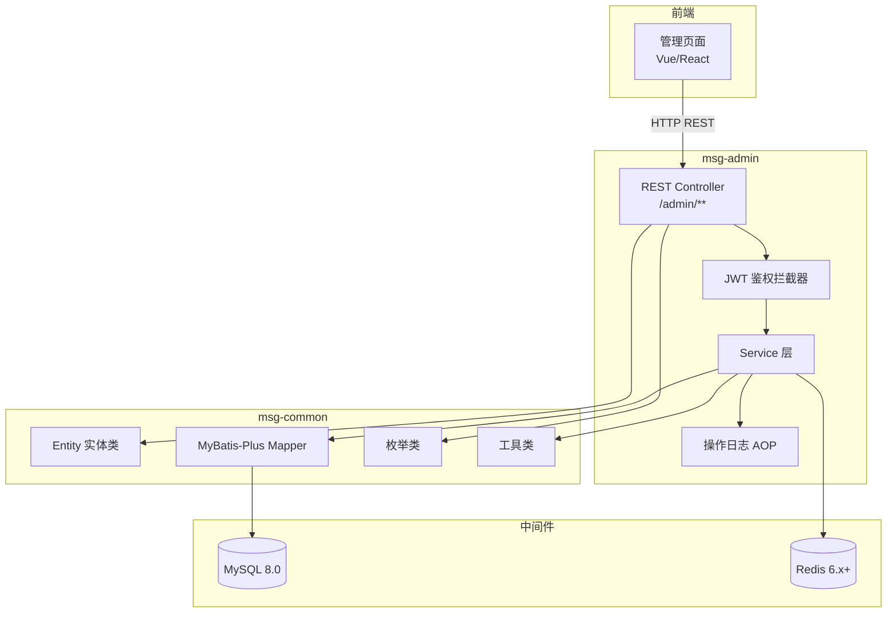

# 设计文档：消息下发系统后台管理 API（msg-admin-api）

## 概述

msg-admin-api 是消息下发系统的后台管理模块，作为独立的 SpringBoot 微服务部署，为前端可视化管理页面提供 RESTful API。该模块覆盖消息模板管理、渠道配置管理、消息记录查询与统计、黑白名单管理、操作日志审计等核心运营功能。

模块直接依赖 msg-common 公共模块（复用实体类、枚举、Mapper、工具类），直接操作 MySQL 和 Redis，不经过 msg-access 接入层。采用 JWT Token 独立鉴权，与接入层的 HMAC 签名鉴权互不干扰。

### 设计决策

1. **独立模块部署**：msg-admin 作为父 POM 的新子模块 `msg-admin`，独立端口运行，避免与接入层/消息中心的流量互相影响。
2. **复用 msg-common**：直接使用已有的 Entity、Mapper、枚举和工具类，避免重复定义。新增的管理专用实体（黑白名单表、操作日志表）和 Mapper 放在 msg-common 中，保持数据层统一。
3. **JWT 鉴权**：管理端使用 JWT Token 鉴权，与接入层的 AppKey+HMAC 签名鉴权完全独立。JWT 有效期可配置，默认 2 小时。
4. **AOP 操作日志**：通过自定义注解 `@OperationLog` + AOP 切面自动记录写操作日志，避免在每个 Service 方法中手动埋点。
5. **脱敏策略**：复用 msg-common 中已有的 `SensitiveDataUtil`，在 VO 转换层统一处理 receiver 脱敏和渠道 Secret 脱敏。

## 架构

### 模块在系统中的位置



### 分层架构

```
msg-admin/
├── controller/        # REST Controller（参数校验、VO 转换、脱敏）
│   ├── TemplateController        /admin/template
│   ├── ChannelController         /admin/channel
│   ├── MessageController         /admin/message
│   ├── StatisticsController      /admin/statistics
│   ├── BlacklistController       /admin/blacklist
│   ├── WhitelistController       /admin/whitelist
│   ├── OperationLogController    /admin/operation-log
│   └── AuthController            /admin/auth
├── service/           # 业务逻辑层
│   ├── AdminTemplateService
│   ├── AdminChannelService
│   ├── AdminMessageService
│   ├── AdminStatisticsService
│   ├── AdminBlacklistService
│   ├── AdminWhitelistService
│   └── AdminOperationLogService
├── auth/              # JWT 鉴权
│   ├── JwtUtil
│   └── JwtAuthInterceptor
├── config/            # 配置
│   ├── WebMvcConfig
│   └── CorsConfig
├── aop/               # AOP 切面
│   ├── OperationLog（注解）
│   └── OperationLogAspect
├── dto/               # 请求/响应 DTO
│   ├── request/       # 请求参数
│   └── response/      # 响应 VO
└── exception/         # 异常处理
    └── GlobalExceptionHandler
```

## 组件与接口

### 组件 1：AuthController — 登录鉴权

**职责**：操作员登录，签发 JWT Token。

```java
@RestController
@RequestMapping("/admin/auth")
public class AuthController {

    /**
     * 操作员登录
     * POST /admin/auth/login
     * @param request { username, password }
     * @return Result<LoginResponse> 含 token 和过期时间
     */
    Result<LoginResponse> login(@RequestBody @Valid LoginRequest request);
}
```

### 组件 2：JwtAuthInterceptor — JWT 鉴权拦截器

**职责**：拦截 `/admin/**` 请求（排除 `/admin/auth/login`），从 `Authorization: Bearer {token}` 提取并验证 JWT。

```java
public class JwtAuthInterceptor implements HandlerInterceptor {
    /**
     * 前置条件：请求路径匹配 /admin/**
     * 后置条件：
     *   - Token 有效 → 放行，将操作员信息存入 ThreadLocal
     *   - Token 缺失/无效/过期 → 返回 HTTP 401
     */
    boolean preHandle(HttpServletRequest request, HttpServletResponse response, Object handler);
}
```

### 组件 3：TemplateController — 消息模板管理

**职责**：消息模板 CRUD、启用/禁用、分页查询。

```java
@RestController
@RequestMapping("/admin/template")
public class TemplateController {

    /** 创建模板 */
    Result<Long> create(@RequestBody @Valid TemplateCreateRequest request);

    /** 更新模板 */
    Result<Void> update(@PathVariable Long id, @RequestBody @Valid TemplateUpdateRequest request);

    /** 删除模板 */
    Result<Void> delete(@PathVariable Long id);

    /** 分页查询（支持 templateName、channelType、enabled 筛选） */
    Result<PageResult<TemplateVO>> page(TemplatePageRequest request);

    /** 查询模板详情 */
    Result<TemplateVO> detail(@PathVariable Long id);

    /** 切换启用/禁用状态 */
    Result<Void> toggleStatus(@PathVariable Long id);
}
```

### 组件 4：ChannelController — 渠道配置管理

**职责**：渠道配置 CRUD、启用/禁用、Secret 脱敏。

```java
@RestController
@RequestMapping("/admin/channel")
public class ChannelController {

    Result<Long> create(@RequestBody @Valid ChannelCreateRequest request);
    Result<Void> update(@PathVariable Long id, @RequestBody @Valid ChannelUpdateRequest request);
    Result<Void> delete(@PathVariable Long id);
    Result<PageResult<ChannelVO>> page(ChannelPageRequest request);
    Result<Void> toggleStatus(@PathVariable Long id);
}
```

**脱敏规则**：ChannelVO 中的 config JSON 字段，对其中的 `secret`、`token` 等敏感 key 的值进行脱敏（保留前 4 位和后 4 位，中间用 `****` 替代）。

### 组件 5：MessageController — 消息记录查询

**职责**：消息记录分页查询、详情查询（含回执）、receiver 脱敏。

```java
@RestController
@RequestMapping("/admin/message")
public class MessageController {

    /** 分页查询（支持 msgId、bizType、bizId、channel、status、receiver、时间范围） */
    Result<PageResult<MessageVO>> page(MessagePageRequest request);

    /** 消息详情（含回执列表） */
    Result<MessageDetailVO> detail(@PathVariable String msgId);
}
```

### 组件 6：StatisticsController — 消息统计

**职责**：状态维度统计、渠道维度统计、按天趋势。

```java
@RestController
@RequestMapping("/admin/statistics")
public class StatisticsController {

    /** 状态维度统计 */
    Result<List<StatusCountVO>> statusOverview(StatisticsRequest request);

    /** 渠道维度统计 */
    Result<List<ChannelStatVO>> channelOverview(StatisticsRequest request);

    /** 按天趋势 */
    Result<List<DailyTrendVO>> dailyTrend(StatisticsRequest request);
}
```

### 组件 7：BlacklistController / WhitelistController — 黑白名单管理

**职责**：黑白名单增删查、Redis 缓存同步、receiver 脱敏。

```java
@RestController
@RequestMapping("/admin/blacklist")
public class BlacklistController {

    Result<Void> add(@RequestBody @Valid BlacklistAddRequest request);
    Result<Void> remove(@PathVariable Long id);
    Result<PageResult<BlacklistVO>> page(BlacklistPageRequest request);
}

@RestController
@RequestMapping("/admin/whitelist")
public class WhitelistController {

    Result<Void> add(@RequestBody @Valid WhitelistAddRequest request);
    Result<Void> remove(@PathVariable Long id);
    Result<PageResult<WhitelistVO>> page(WhitelistPageRequest request);
}
```

### 组件 8：OperationLogAspect — 操作日志 AOP

**职责**：通过 `@OperationLog` 注解自动记录写操作日志。

```java
@Target(ElementType.METHOD)
@Retention(RetentionPolicy.RUNTIME)
public @interface OperationLog {
    String operationType();   // CREATE / UPDATE / DELETE / STATUS_CHANGE
    String objectType();      // TEMPLATE / CHANNEL / BLACKLIST / WHITELIST
}

@Aspect
@Component
public class OperationLogAspect {
    /**
     * 环绕通知：
     * 1. 方法执行前记录请求参数（操作前数据）
     * 2. 方法执行后记录响应结果（操作后数据）
     * 3. 从 ThreadLocal 获取当前操作员信息
     * 4. 异步写入 t_admin_operation_log 表
     */
    @Around("@annotation(operationLog)")
    Object around(ProceedingJoinPoint pjp, OperationLog operationLog);
}
```

### 组件 9：AdminStatisticsService — 统计服务

**职责**：基于 MyBatis-Plus 的 GROUP BY 聚合查询实现统计。

```java
@Service
public class AdminStatisticsService {

    /**
     * 按状态分组统计消息数量
     * SQL: SELECT status, COUNT(*) as count FROM t_msg
     *      WHERE create_time BETWEEN #{startTime} AND #{endTime}
     *      GROUP BY status
     */
    List<StatusCountVO> countByStatus(LocalDateTime startTime, LocalDateTime endTime);

    /**
     * 按渠道分组统计总量和成功率
     * SQL: SELECT channel, COUNT(*) as total,
     *             SUM(CASE WHEN status='SUCCESS' THEN 1 ELSE 0 END) as successCount
     *      FROM t_msg
     *      WHERE create_time BETWEEN #{startTime} AND #{endTime}
     *      GROUP BY channel
     */
    List<ChannelStatVO> countByChannel(LocalDateTime startTime, LocalDateTime endTime);

    /**
     * 按天聚合趋势
     * SQL: SELECT DATE(create_time) as date, COUNT(*) as count
     *      FROM t_msg
     *      WHERE create_time BETWEEN #{startTime} AND #{endTime}
     *      GROUP BY DATE(create_time)
     *      ORDER BY date ASC
     */
    List<DailyTrendVO> dailyTrend(LocalDateTime startTime, LocalDateTime endTime);
}
```

### 组件 10：GlobalExceptionHandler — 全局异常处理

**职责**：统一异常处理，遵循 REST API 规范。

```java
@RestControllerAdvice
public class GlobalExceptionHandler {

    /** 参数校验失败 → HTTP 400 */
    @ExceptionHandler(MethodArgumentNotValidException.class)
    @ResponseStatus(HttpStatus.BAD_REQUEST)
    Result<Void> handleValidation(MethodArgumentNotValidException ex);

    /** 资源不存在 → HTTP 404 */
    @ExceptionHandler(ResourceNotFoundException.class)
    @ResponseStatus(HttpStatus.NOT_FOUND)
    Result<Void> handleNotFound(ResourceNotFoundException ex);

    /** 业务异常（如编码重复） → HTTP 400 */
    @ExceptionHandler(BusinessException.class)
    @ResponseStatus(HttpStatus.BAD_REQUEST)
    Result<Void> handleBusiness(BusinessException ex);

    /** 未授权 → HTTP 401 */
    @ExceptionHandler(UnauthorizedException.class)
    @ResponseStatus(HttpStatus.UNAUTHORIZED)
    Result<Void> handleUnauthorized(UnauthorizedException ex);

    /** 兜底异常 → HTTP 500，不暴露堆栈 */
    @ExceptionHandler(Exception.class)
    @ResponseStatus(HttpStatus.INTERNAL_SERVER_ERROR)
    Result<Void> handleGeneric(Exception ex);
}
```


## 数据模型

### 复用已有表

以下表已在 msg-common 中定义，msg-admin 直接复用其 Entity 和 Mapper：

| 表名 | Entity | 用途 |
|------|--------|------|
| t_msg | MessageEntity | 消息记录查询、统计 |
| t_msg_receipt | MessageReceiptEntity | 消息回执查询 |
| t_channel_config | ChannelConfigEntity | 渠道配置管理 |
| t_msg_template | MessageTemplateEntity | 消息模板管理 |

### 新增表：黑名单表（t_blacklist）

```sql
CREATE TABLE t_blacklist (
    id          BIGINT AUTO_INCREMENT PRIMARY KEY,
    receiver    VARCHAR(256) NOT NULL COMMENT '接收人标识（手机号/邮箱/设备ID）',
    channel     VARCHAR(32)  NOT NULL COMMENT '渠道类型: SMS/EMAIL/APP_PUSH/WEBHOOK',
    reason      VARCHAR(512)          COMMENT '加入原因',
    operator    VARCHAR(64)           COMMENT '操作员',
    create_time DATETIME     NOT NULL DEFAULT CURRENT_TIMESTAMP,
    UNIQUE KEY uk_receiver_channel (receiver, channel)
) COMMENT '黑名单表';
```

```java
@Data
@Builder
@NoArgsConstructor
@AllArgsConstructor
@TableName("t_blacklist")
public class BlacklistEntity {
    @TableId(type = IdType.AUTO)
    private Long id;
    private String receiver;
    private String channel;
    private String reason;
    private String operator;
    private LocalDateTime createTime;
}
```

**Redis 缓存 Key**：`blacklist:{channel}:{receiver}` → value: `"1"`，与 msg-center 的 BlacklistService 共享同一 Redis 实例。

### 新增表：白名单表（t_whitelist）

```sql
CREATE TABLE t_whitelist (
    id          BIGINT AUTO_INCREMENT PRIMARY KEY,
    receiver    VARCHAR(256) NOT NULL COMMENT '接收人标识',
    channel     VARCHAR(32)  NOT NULL COMMENT '渠道类型',
    operator    VARCHAR(64)           COMMENT '操作员',
    create_time DATETIME     NOT NULL DEFAULT CURRENT_TIMESTAMP,
    UNIQUE KEY uk_receiver_channel (receiver, channel)
) COMMENT '白名单表';
```

```java
@Data
@Builder
@NoArgsConstructor
@AllArgsConstructor
@TableName("t_whitelist")
public class WhitelistEntity {
    @TableId(type = IdType.AUTO)
    private Long id;
    private String receiver;
    private String channel;
    private String operator;
    private LocalDateTime createTime;
}
```

**Redis 缓存 Key**：`whitelist:{channel}:{receiver}` → value: `"1"`

### 新增表：操作日志表（t_admin_operation_log）

```sql
CREATE TABLE t_admin_operation_log (
    id              BIGINT AUTO_INCREMENT PRIMARY KEY,
    operator        VARCHAR(64)  NOT NULL COMMENT '操作员用户名',
    operation_type  VARCHAR(32)  NOT NULL COMMENT '操作类型: CREATE/UPDATE/DELETE/STATUS_CHANGE',
    object_type     VARCHAR(32)  NOT NULL COMMENT '操作对象类型: TEMPLATE/CHANNEL/BLACKLIST/WHITELIST',
    object_id       VARCHAR(64)           COMMENT '操作对象ID',
    before_data     TEXT                  COMMENT '操作前数据(JSON)',
    after_data      TEXT                  COMMENT '操作后数据(JSON)',
    operation_time  DATETIME     NOT NULL DEFAULT CURRENT_TIMESTAMP,
    INDEX idx_operator (operator),
    INDEX idx_operation_type (operation_type),
    INDEX idx_operation_time (operation_time)
) COMMENT '管理端操作日志表';
```

```java
@Data
@Builder
@NoArgsConstructor
@AllArgsConstructor
@TableName("t_admin_operation_log")
public class OperationLogEntity {
    @TableId(type = IdType.AUTO)
    private Long id;
    private String operator;
    private String operationType;
    private String objectType;
    private String objectId;
    private String beforeData;
    private String afterData;
    private LocalDateTime operationTime;
}
```

### 新增表：管理员表（t_admin_user）

```sql
CREATE TABLE t_admin_user (
    id          BIGINT AUTO_INCREMENT PRIMARY KEY,
    username    VARCHAR(64)  NOT NULL COMMENT '用户名',
    password    VARCHAR(256) NOT NULL COMMENT '密码(BCrypt)',
    status      TINYINT      NOT NULL DEFAULT 1 COMMENT '状态: 1-启用 0-禁用',
    create_time DATETIME     NOT NULL DEFAULT CURRENT_TIMESTAMP,
    update_time DATETIME     NOT NULL DEFAULT CURRENT_TIMESTAMP ON UPDATE CURRENT_TIMESTAMP,
    UNIQUE KEY uk_username (username)
) COMMENT '管理员用户表';
```

### 统一分页响应结构

```java
@Data
@Builder
@NoArgsConstructor
@AllArgsConstructor
public class PageResult<T> {
    /** 数据列表 */
    private List<T> records;
    /** 总记录数 */
    private long total;
    /** 当前页码 */
    private int pageNum;
    /** 每页大小 */
    private int pageSize;
}
```

### 脱敏规则

| 场景 | 规则 | 示例 |
|------|------|------|
| 手机号 receiver | 保留前 3 位和后 4 位，中间 `****` | `138****5678` |
| 邮箱 receiver | 保留首字符 + `***@` + 域名 | `t***@example.com` |
| 渠道 Secret/Token | 保留前 4 位和后 4 位，中间 `****` | `sk_t****_key` |

手机号和邮箱脱敏复用 `SensitiveDataUtil.maskPhone()` / `maskEmail()`。渠道 Secret 脱敏新增 `SensitiveDataUtil.maskSecret()` 方法。

### 渠道 Secret 脱敏算法

```java
/**
 * 算法：渠道配置 Secret/Token 脱敏
 * 输入：secretValue — 原始 Secret 字符串
 * 输出：脱敏后的字符串
 *
 * 前置条件：secretValue 非 null
 * 后置条件：
 *   - 长度 <= 8 → 全部替换为 "****"
 *   - 长度 > 8 → 保留前 4 位 + "****" + 后 4 位
 *   - 原始值不可从脱敏结果反推
 */
public static String maskSecret(String secretValue) {
    if (secretValue == null || secretValue.length() <= 8) {
        return "****";
    }
    return secretValue.substring(0, 4) + "****" + secretValue.substring(secretValue.length() - 4);
}
```

### 渠道 Config JSON 脱敏算法

```java
/**
 * 算法：渠道配置 JSON 中敏感字段脱敏
 * 输入：configJson — 渠道配置 JSON 字符串（如 {"appKey":"xxx","secret":"yyy","endpoint":"zzz"}）
 * 输出：脱敏后的 JSON 字符串
 *
 * 前置条件：configJson 为合法 JSON 字符串或 null
 * 后置条件：
 *   - JSON 中 key 包含 "secret"、"token"、"password"（不区分大小写）的值被脱敏
 *   - 其他字段保持不变
 *   - null 输入返回 null
 */
public static String maskConfigJson(String configJson) {
    // 解析 JSON → 遍历 key → 匹配敏感 key → maskSecret(value) → 序列化回 JSON
}
```


## 正确性属性

*属性是系统在所有合法执行中应保持为真的特征或行为——本质上是关于系统应该做什么的形式化声明。属性是人类可读规格说明与机器可验证正确性保证之间的桥梁。*

### Property 1: 模板 CRUD 往返一致性

*For any* 合法的模板数据（templateCode、templateName、channelType、content、variables），创建模板后查询其详情，返回的所有字段值应与创建时提交的数据一致。

**Validates: Requirements 1.1, 1.6**

### Property 2: 唯一编码重复拒绝

*For any* 已存在的 templateCode 或 channelCode，再次提交相同编码的创建请求时，服务应拒绝创建并返回包含"已存在"的错误信息，且数据库中该编码的记录数仍为 1。

**Validates: Requirements 1.2, 2.2**

### Property 3: 数据变更清除 Redis 缓存

*For any* 已缓存的模板记录，执行更新、删除或状态切换操作后，该模板对应的 Redis 缓存 key 应不存在。

**Validates: Requirements 1.3, 1.4, 1.7**

### Property 4: 分页查询过滤正确性

*For any* 分页查询请求携带的筛选条件，返回的 records 列表中每条记录都应满足所有筛选条件，且 total 应等于数据库中满足条件的总记录数。

**Validates: Requirements 1.5, 2.5, 3.1, 5.3, 5.6, 8.2**

### Property 5: 渠道 Secret 脱敏不可逆

*For any* 长度大于 8 的 Secret 字符串，脱敏后的结果应仅保留前 4 位和后 4 位，中间为 `****`；且脱敏结果的长度应为 `4 + 4 + 4 = 12`。对于长度 ≤ 8 的字符串，脱敏结果应为 `****`。原始完整值不应出现在脱敏结果中（当长度 > 8 时）。

**Validates: Requirements 2.7**

### Property 6: Receiver 脱敏正确性

*For any* 11 位中国大陆手机号（1[3-9] 开头），脱敏后应为前 3 位 + `****` + 后 4 位，且原始中间 4 位不出现在结果中。*For any* 合法邮箱地址，脱敏后应为首字符 + `***@` + 域名，且原始用户名不出现在结果中。

**Validates: Requirements 3.4, 5.7**

### Property 7: 统计聚合正确性

*For any* 时间范围内的消息集合，状态维度统计的各状态数量之和应等于该时间范围内的消息总数；渠道维度统计的各渠道总量之和也应等于消息总数；渠道成功率应等于该渠道 SUCCESS 数量除以该渠道总量。

**Validates: Requirements 4.1, 4.2**

### Property 8: 按天趋势聚合正确性

*For any* 时间范围内的消息集合，按天趋势返回的每日数量之和应等于该时间范围内的消息总数，且日期应按升序排列。

**Validates: Requirements 4.3**

### Property 9: 黑白名单 DB-Redis 同步一致性

*For any* 黑名单或白名单的添加操作，操作完成后 Redis 中对应的缓存 key 应存在；*For any* 移除操作，操作完成后 Redis 中对应的缓存 key 应不存在。即 DB 记录与 Redis 缓存始终保持一致。

**Validates: Requirements 5.1, 5.2, 5.4, 5.5**

### Property 10: 非法参数返回 400

*For any* 缺少必填字段或字段值不合法的请求，服务应返回 HTTP 400 状态码，且响应体中 success 为 false、code 为 400。

**Validates: Requirements 6.3**

### Property 11: 内部异常不泄露堆栈

*For any* 服务内部未预期异常，API 响应体中不应包含 Java 类名（如 `Exception`、`at com.`）、堆栈信息或内部实现细节，仅返回通用错误信息。

**Validates: Requirements 6.5**

### Property 12: JWT Token 鉴权有效性

*For any* 合法的用户名密码组合，登录后返回的 JWT Token 应能通过验证并访问管理 API；*For any* 无效、篡改或过期的 Token，访问管理 API 应返回 HTTP 401。

**Validates: Requirements 7.1, 7.2, 7.3, 7.4**

### Property 13: 写操作产生审计日志

*For any* 创建、更新、删除或状态变更操作，操作完成后 t_admin_operation_log 表中应存在对应的日志记录，且日志记录包含操作员、操作类型、操作对象类型、操作时间字段，均非空。

**Validates: Requirements 8.1, 8.3**


## 错误处理

### 场景 1：参数校验失败

**触发条件**：请求参数缺少必填字段、字段格式不合法（如 channelType 不在枚举范围内）
**处理方式**：Spring Validation（JSR303）自动校验，`MethodArgumentNotValidException` 被 GlobalExceptionHandler 捕获
**响应**：HTTP 400，`Result.fail(400, "参数校验失败: " + details)`

### 场景 2：资源不存在

**触发条件**：按 ID 查询/更新/删除模板、渠道配置、黑白名单时，记录不存在
**处理方式**：Service 层查询后判空，抛出 `ResourceNotFoundException`
**响应**：HTTP 404，`Result.fail(404, "资源不存在")`

### 场景 3：唯一编码冲突

**触发条件**：创建模板时 templateCode 重复，创建渠道配置时 channelCode 重复
**处理方式**：Service 层先查询是否存在，存在则抛出 `BusinessException`；同时依赖 DB 唯一索引兜底，捕获 `DuplicateKeyException` 转为 `BusinessException`
**响应**：HTTP 400，`Result.fail(400, "模板编码已存在")` 或 `Result.fail(400, "渠道编码已存在")`

### 场景 4：JWT Token 无效

**触发条件**：Token 缺失、格式错误、签名不匹配、已过期
**处理方式**：`JwtAuthInterceptor` 在 preHandle 中校验，失败时直接写入 HTTP 401 响应
**响应**：HTTP 401，`Result.fail(401, "未授权")` 或 `Result.fail(401, "Token 已过期")`

### 场景 5：Redis 不可用

**触发条件**：Redis 连接超时或宕机
**处理方式**：缓存操作使用 try-catch 包裹，Redis 异常不影响主流程（DB 操作正常完成），仅记录 WARN 日志
**恢复策略**：Redis 恢复后，下次写操作会重新同步缓存；也可通过管理接口手动触发缓存重建

### 场景 6：未预期异常

**触发条件**：任何未被特定 ExceptionHandler 捕获的异常
**处理方式**：GlobalExceptionHandler 兜底捕获，记录 ERROR 日志（含完整堆栈），返回通用错误信息
**响应**：HTTP 500，`Result.fail(500, "系统异常")`，不暴露内部堆栈

## 测试策略

### 单元测试

**覆盖目标**：Service 层核心业务逻辑 ≥ 85% 行覆盖率

**关键测试用例**：
- 模板 CRUD：创建、更新、删除、查询详情、分页查询
- 渠道配置 CRUD：创建、更新、删除、分页查询、状态切换
- 唯一编码冲突：templateCode 重复、channelCode 重复
- 脱敏函数：maskPhone、maskEmail、maskSecret、maskConfigJson
- JWT 工具类：生成 Token、解析 Token、过期 Token、无效 Token
- 统计查询：状态维度、渠道维度、按天趋势
- 黑白名单：添加、移除、Redis 缓存同步
- 操作日志 AOP：验证写操作触发日志记录

**测试框架**：JUnit 5 + Mockito + H2 内存数据库

### 属性测试

**属性测试库**：jqwik 1.8.x（Java Property-Based Testing，已在父 POM 中声明）

**配置**：每个属性测试最少运行 100 次迭代。

**属性测试用例**：

- **Feature: msg-admin-api, Property 1: 模板 CRUD 往返一致性**
  随机生成合法模板数据，创建后查询详情，验证字段一致。

- **Feature: msg-admin-api, Property 2: 唯一编码重复拒绝**
  随机生成 templateCode/channelCode，创建两次，验证第二次被拒绝。

- **Feature: msg-admin-api, Property 5: 渠道 Secret 脱敏不可逆**
  随机生成不同长度的 Secret 字符串，验证脱敏规则：长度 > 8 时保留前 4 后 4，长度 ≤ 8 时全部替换为 `****`，且原始完整值不出现在结果中。

- **Feature: msg-admin-api, Property 6: Receiver 脱敏正确性**
  随机生成 11 位手机号和邮箱地址，验证脱敏后格式正确且原始敏感部分不出现。

- **Feature: msg-admin-api, Property 7: 统计聚合正确性**
  随机生成一组消息记录（随机状态和渠道），插入后查询统计，验证各维度数量之和等于总数。

- **Feature: msg-admin-api, Property 9: 黑白名单 DB-Redis 同步一致性**
  随机生成 receiver+channel 组合，执行添加/移除操作，验证 DB 和 Redis 状态一致。

- **Feature: msg-admin-api, Property 10: 非法参数返回 400**
  随机生成缺少必填字段或字段值非法的请求，验证响应为 HTTP 400。

- **Feature: msg-admin-api, Property 12: JWT Token 鉴权有效性**
  随机生成用户名，签发 Token 后验证可解析；篡改 Token 后验证解析失败。

- **Feature: msg-admin-api, Property 13: 写操作产生审计日志**
  随机选择写操作类型，执行后验证 t_admin_operation_log 中存在对应记录。

### 集成测试

**测试范围**：
- Controller 层端到端测试（MockMvc）：验证 HTTP 状态码、响应格式、CORS 头
- JWT 鉴权拦截器集成测试：验证有效/无效/过期 Token 的拦截行为
- 全局异常处理集成测试：验证各类异常的 HTTP 状态码和响应格式
- Redis 缓存同步集成测试：验证模板缓存清除和黑白名单缓存同步

**测试环境**：
- H2 内存数据库（单元测试和集成测试）
- Embedded Redis（集成测试中的 Redis 缓存验证）
- Spring MockMvc（Controller 层测试）
